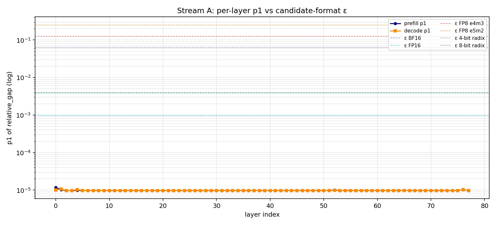
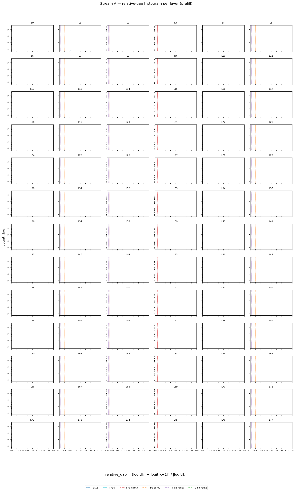
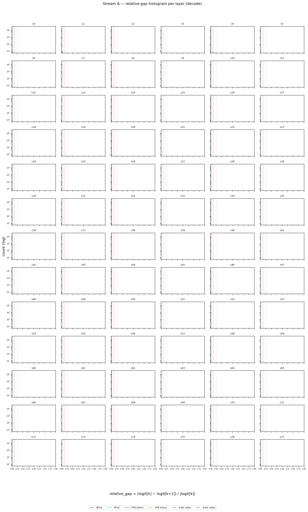
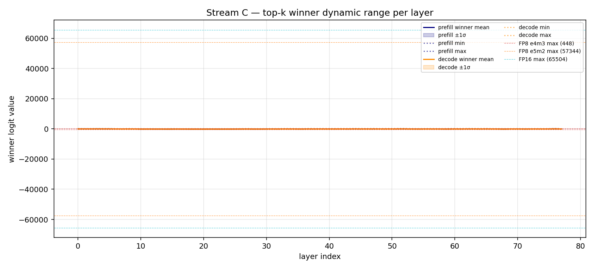
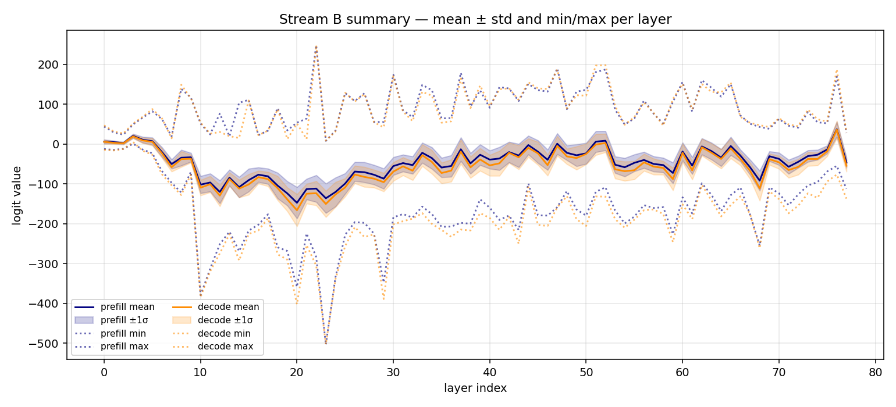
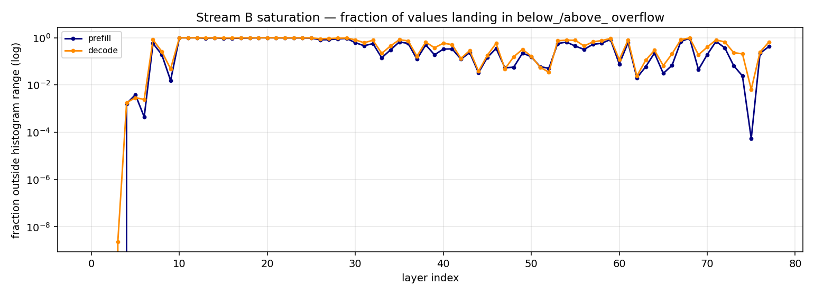

# GLM‑5.1 Lightning Indexer Logit Distribution Experiment

---

> ## ⚠️ RETRACTION NOTICE (top of doc)
>
> An earlier version of this document (commit history before §16.8 was added) recommended a "best‑4 / 16 bucket / 1 pass" RDU radix kernel configuration based on a misinterpretation of the Cascade‑BestD measurement. **That recommendation is wrong — it produces only ~27 % recall of the true top‑2048**, not the implied 100 % correctness. **See §16.8 for the full correction and empirical proof.**
>
> The Cascade‑BestD stream measured *bucket‑fit uniformity*, not algorithmic correctness. For radix top‑k to be correct, the bit window must include the most‑significant bits where items differ — which means **top‑d bits**, not max‑entropy mantissa bits. Mantissa‑middle bits give a hash‑like partition, not a value‑order partition.
>
> **The authoritative recommendation is `top‑12 / 4 096 buckets / 1 pass` (validated, correct).** Everything else in the doc below should be read with this retraction in mind; specific superseded sections are flagged inline.

---

## TL;DR

**Goal.** Design a cheaper top‑k radix sort for DSA‑architecture inference on RDU, sized from real workload data instead of guesses. The indexer's top‑k is the dominant per‑step cost in the long‑context regime DSA is built for.

**What we measured.**

- **run03** (130 prompts): cascade behaviour at top‑d bits for d ∈ {4, 8, 12, 16}, plus per‑bit entropy across 22 M decode rows.
- **run04** (75 prompts, 36 M decode rows): cascade behaviour at *custom* bit windows. **Limitation we missed at the time:** the measurement scored bucket fit assuming bucket‑id ≅ value order, which is false for the custom (mantissa‑middle) windows. See §16.8.

Both runs: 0 failures, 0 recorder errors. Measurements are accurate; the algorithmic interpretation of run04 was wrong (corrected in §16.8).

**Headline finding (corrected after the §16.8 audit):**

| Bit window | Buckets | One‑pass fit | **Recall of true top‑2048** | Verdict |
|---|---|---|---|---|
| top‑12 (bits 20–31) | **4 096** | 100 % | **100 %** ✅ | **Correct, 1 pass** |
| top‑16 (bits 16–31) | 65 536 | 100 % | 100 % ✅ | Correct, 1 pass (SMEM heavy) |
| top‑8 (bits 24–31) | 256 | 64 % | 100 % (after cascade) ✅ | Correct, needs cascade |
| top‑4 (bits 28–31) | 16 | 0 % | 100 % (after cascade) ✅ | Correct, needs cascade |
| ~~best‑4 (bits 9–12)~~ | ~~16~~ | ~~100 %~~ | **27 %** ❌ | **Algorithmically wrong** |
| ~~best‑8 (bits 5–12)~~ | ~~256~~ | ~~100 %~~ | **26 %** ❌ | **Algorithmically wrong** |
| ~~best‑12 (bits 1–12)~~ | ~~4 096~~ | ~~100 %~~ | **26 %** ❌ | **Algorithmically wrong** |

**Why the "best‑d" rows fail.** Radix top‑k requires the bit window to include the most‑significant bits where items differ. Best‑d picks max‑entropy bits (mantissa middle), which are NOT the most significant; items that differ in bits *above* the window are misranked. Bucket‑fit was uniform (which is why we believed the bogus result), but the algorithm picks roughly random ~2 048 items, not the true top‑2 048.

**RDU recommendation (corrected — replaces previous "best‑4" recommendation):**

| Config | Buckets | Passes | Bit window | On‑chip mem | Confidence |
|---|---|---|---|---|---|
| **Safe baseline (fully validated)** | **4 096** | **1** | **bits 20–31 (top‑12)** | **~16 KB / row** | **directly measured + correctness verified ✓** |
| **Memory‑optimised (rescued — see §16.8.8)** | **16** | **~3** | **top‑4 with cascade** (standard MSD radix select) | **~64 B / pass** | **algorithm correct by construction ✓** — pass count for DSA is **inferred** (12 bits suffice in one pass at d=12 → 3 passes of d=4 ≈ same budget). Direct measurement of the multi‑pass cascade depth is an open follow‑up. |

The two options span the **memory ↔ pass‑count trade‑off** within the top‑d family. The "256× memory savings" really is achievable — it just costs **~3 passes instead of 1**, paid in cycles rather than bytes. There is no free lunch.

The earlier (now retracted) claim was "256× memory savings AND only 1 pass" via best‑d at mantissa middle. That was the algorithmic error — the memory savings collapse if you require single‑pass correctness; you have to spend cascade depth to get them.

**What this experiment actually establishes:**

- Single‑pass top‑12 (4 096 buckets) gives correct top‑k on DSA — **directly measured**, 100 % recall on 78 / 78 layers.
- Multi‑pass MSD radix select (any d ≥ 1) is algorithmically correct by construction; the d=4 / 16‑bucket variant gives the smallest per‑pass histogram (~64 B). The DSA‑specific pass count (~3 for d=4) is **inferred** from the single‑pass measurements, not directly measured.
- BitEntropy is a valid descriptive measurement of DSA logit distributions, but it does NOT prescribe a one‑pass kernel design. Its role is in **cascade design** (where to allocate depth in the bit range), not in **bit‑window selection** for one‑pass radix.

**Where to look next.** **§16.8** — the empirical correction. **§16.8.8** — the rescued multi‑pass recommendation. §16.7 / §16.4 — superseded but kept for transparency. **Methodology**: §1–§5. **Open follow‑ups**: §16.6.

---

## 1. Goal

**Decide whether the GLM‑5.1 lightning‑indexer's top‑k selection can be sped up by switching to a cheaper sort/precision scheme — and if so, which — without measurably degrading model accuracy.**

The expensive step is the **per‑row top‑k sort** itself: `k = index_topk = 2048` keys selected from `N_k` candidates, every query token, every layer, every step. The DeepGEMM kernels (`fp8_mqa_logits` / `fp8_paged_mqa_logits`) emit logits in **FP32**, so the hand‑rolled top‑k kernel that follows is doing a 32‑bit‑precision sort even though we only need enough resolution to keep the top‑k ordering stable. Decode re‑runs the sort from scratch every generated token (no incremental reuse), so cost compounds with sequence length — making the sort the dominant per‑step cost in the long‑context regime DSA is supposed to help with.

Two cheap‑out candidates attack the sort directly:

1. **Smaller dtype** for the logits (FP32 → BF16 → FP16 → FP8 e4m3 / e5m2). Fewer bits → cheaper compares; FP8 in particular makes integer‑compare top‑k feasible.
2. **Top‑bits radix sort**: inspect only the top ~4–8 bits during the sort. A radix pass per bit replaces an `O(N log k)` comparison sort — 4‑bit radix is 1–2 passes instead of `log₂(N_k) ≈ 13` compare rounds.

These two axes are independent and compose. You can radix‑sort FP32 values using top‑N‑bits directly, or apply both (FP8 storage plus top‑bits radix). The storage‑precision axis cuts HBM bandwidth on the logits read; the sort‑precision axis cuts compute on the comparisons. The effective precision floor for the gap test is whichever of the two is coarser.

Either trick is safe **iff** the indexer logit distribution has a **comfortable margin around the top‑k boundary** — i.e., the gap between `logit[k]` and `logit[k+1]` is large enough that quantization or bit‑truncation noise won't reorder which indices fall into the top‑k.

So the experiment answers one operational question:

> **For each layer of GLM‑5.1, what is the lower‑tail (p1) of the per‑token relative gap `(logit[k] − logit[k+1]) / |logit[k]|` across a representative workload?**

The smallest p1 across all layers is the safety floor; comparing it to each candidate's relative precision decides viability.

### Candidate sort/precision schemes

ε below is the spacing between consecutive representable values near 1, i.e. `2^-m` where `m` is the explicit mantissa‑bit count. Unit roundoff `u = ε/2` is half this; either is fine as a safety bound since the §1.1 test is already conservative by ~2×.

| Approach | What it does | Why cheaper | ε |
|---|---|---|---|
| **FP32 (baseline)** | Kernel emits FP32, sort in FP32 | status quo | 2⁻²³ ≈ 1.2e‑7 |
| **BF16** | Down‑cast logits to BF16, sort in BF16 | halves the sort's compare width | 2⁻⁷ ≈ 7.8e‑3 |
| **FP16** | Down‑cast logits to FP16, sort in FP16 | finer than BF16, same width | 2⁻¹⁰ ≈ 9.8e‑4 |
| **FP8 e4m3** | Down‑cast to FP8 (Q/K inputs are already FP8) | enables integer‑compare top‑k | 1/8 = 0.125 |
| **FP8 e5m2** | Wider range, coarser precision | same as e4m3 plus more headroom | 1/4 = 0.25 |
| **Top‑bits radix sort** | Sort using top 4–8 bits only | 1–2 radix passes vs ~13 compare rounds | 1/16 = 0.0625 (4‑bit) |

The shared failure mode across candidates: comparisons at the top‑k boundary flip under quantization noise, producing a different selected key set and therefore different sparse‑attention output. The experiment quantifies the margin so each candidate's risk is judged before paying engineering cost.

## 1.1 Why "relative gap at the boundary" is the right measurement

- **Top‑k must be correct per token, not on average.** Wrong top‑k on one token → wrong sparse‑attention set → quality regression. The statistic that bounds correctness is the **lower tail** of the per‑token gap distribution, not its bulk or median.
- **The k vs k+1 gap is the bottleneck pair.** All other comparisons in a sort have larger gaps to overcome — the boundary pair has the smallest gap by construction. Quantization noise reorders the boundary pair first.
- **Range alone is insufficient.** Range tells you the dtype's noise floor (`ε ≈ range / 2^bits`); gap tells you the headroom above it. Only the ratio `safety = gap / ε` decides safety.
- **Relative gap collapses both axes.** Recording `(logit[k] − logit[k+1]) / |logit[k]|` (dimensionless) compares directly against each format's ε — one distribution per layer, immediate verdict.
- **Window robustness.** The boundary may sit at the edge of a tight cluster. We record the **min relative gap over `±w` positions around k** (default `w=8`); this catches tightness near the boundary rather than just exactly at k.

### Math derivation: why the denominator is `|top_vals[i, k]|`

Numerical formats have *relative* precision. A value `x` quantized into F is recovered as `x · (1 + δ)` with `|δ| ≤ ε(F)`. Noise scales with magnitude:

| Value | FP8 e4m3 noise (≈ x/8) |
|---|---|
| 1.0 | ±0.125 |
| 10.0 | ±1.25 |
| 100.0 | ±12.5 |

For the boundary pair `(x_k, x_{k+1})` (with `x_k > x_{k+1}`) to flip under quantization:

$$x_k (1 + \delta_k) < x_{k+1} (1 + \delta_{k+1})$$

Worst case `δ_k = -ε`, `δ_{k+1} = +ε`:

$$x_k - x_{k+1} < \varepsilon (x_k + x_{k+1}) \quad\Longleftrightarrow\quad \frac{x_k - x_{k+1}}{x_k + x_{k+1}} < \varepsilon$$

Strictly the denominator is `x_k + x_{k+1} ≈ 2·x_k`. We use `|x_k|` instead — about half the strict denominator — so our `relative_gap` is roughly **2× the strict ratio**: **the test is conservative by ~2×**, with margin built in. We prefer `|x_k|` over `x_k + x_{k+1}` because (a) it's the natural scale at the boundary, (b) sign cancellation in the sum can blow up the ratio (DSA logits can be either sign), and (c) it's simpler to track for reservoir/quantile work. The `|·|` handles negative logits.

### Why p1 of the gap distribution

The thing we're trying to bound is the chance that any given token's top‑k flips under quantization. That's a tail‑probability question, so the relevant statistic lives in the lower tail of the gap distribution. p1 (the 1st percentile of the per‑row gap distribution) gives the floor that 99% of rows clear.

Looser percentiles (p5, p50) miss the long tail of vulnerable rows. Stricter percentiles (p0.1, p0.01) need ~50k+ samples per layer to estimate stably, and histogram bin‑width error dominates at the lowest counts. p1 is the sweet spot for estimation stability at the workload sizes we run. The min (p0) over the whole run is dominated by a single outlier row out of millions; estimates swing between runs and don't represent the operational regime.

At plot time, the decision rule is `safe_layers = {L | p1[L] > ε(F) × safety_factor}`. Typical `safety_factor = 3`, giving roughly "in the worst 1% of rows, we still have 3× margin over noise."

### Decision flow

```
┌─────────────────────────────────────┐
│ Capture per‑layer relative‑gap      │
│ histograms (this experiment)        │
└──────────────┬──────────────────────┘
               ▼
┌─────────────────────────────────────┐
│ For each candidate format F:        │
│   safe_layers(F) =                  │
│     {L | p1[L] > ε(F)·safety_factor}│
└──────────────┬──────────────────────┘
               ▼
┌─────────────────────────────────────┐
│ Option A — Global format:           │
│   pick cheapest F with              │
│   safe_layers(F) == all layers      │
│                                     │
│ Option B — Per‑layer format:        │
│   for each L, assign cheapest F     │
│   with L ∈ safe_layers(F)           │
│                                     │
│ Prefer A if a single F is safe      │
│ everywhere (simpler dispatch).      │
│ Take B only if the format‑safety    │
│ heatmap (§6 plot 3) shows real      │
│ vertical heterogeneity.             │
└──────────────┬──────────────────────┘
               ▼
┌─────────────────────────────────────┐
│ Run end‑to‑end eval at chosen       │
│ assignment vs baseline (AIME /      │
│ GPQA / LCB). This is the FINAL      │
│ accuracy guarantee.                 │
└─────────────────────────────────────┘
```

The histogram experiment narrows the candidate set; the end‑to‑end eval is the accuracy ground truth.

**Global vs per‑layer trade‑off.** A global format means one sort kernel and one dtype across all 75 DSA layers — simple to ship, simple to validate. A per‑layer format extracts more savings when the gap distribution is heterogeneous (e.g. a handful of layers are an order of magnitude tighter than the rest), at the cost of per‑layer dtype dispatch in the sort kernel and a larger eval surface (you're validating a combination, not a single format). After the experiment, decide from plot 3: if all rows of the heatmap look the same, go global; if there's clear vertical structure, per‑layer or layer‑groups can be worth the engineering.

## 1.2 Range diagnostics (Range + Winners streams)

Two additional metrics answer the **range-failure** question from §1.4 — does the candidate dtype's representable range cover the logit values that actually matter?

**Range stream — raw indexer‑logit distribution per layer.** Per‑(query, key) scores produced by the indexer *before* top‑k selection, with masked/invalid positions excluded. Tells us whether the indexer is well‑calibrated (concentrated mass vs heavy tails), whether some layers route attention much more sharply than others, whether anything saturates (FP8 range issues, dead heads), and the global dynamic range any candidate dtype must cover.

**Winners stream — top‑k range.** Per row, the values at ranks `[0, k)` after sorting — i.e., the logits that actually drive sparse attention. Records mean/std/min/max/count only (no histogram). Range stream = range of *all* logits; Winners stream = range of the top‑k subset the indexer *cares about*. Together they answer "does FP8's range cover what matters?"

Gap stream answers the resolution-failure question (§1.1); Range + Winners streams answer the range-failure question (§1.4).

## 1.3 Data product is histograms, never raw logits

Raw indexer logits are too large to land anywhere at any reasonable run scale:

| Quantity | Approx. size |
|---|---|
| One prefill call: `[N_q≈1024, N_k≈8192]` FP32 | ~32 MB |
| × 75 DSA layers per forward step | ~2.4 GB |
| × ~100 forward steps in a moderate eval | ~240 GB |
| × 8 TP ranks | ~2 TB |

The recorder reduces on GPU into per‑layer histograms (Gap and Range streams) or scalar moments (Winners stream). Histograms accumulate **in place** — a 5‑minute run and a 5‑hour run produce the same file size on disk:

| Per‑layer × phase artifact | Bytes |
|---|---|
| Gap stream: hist[4096] + 7 scalars | ~32 KB |
| Range stream: hist[4096] + 7 scalars | ~32 KB |
| Winners stream: 5 scalars | ~40 B |
| **Total per layer per phase** | ~64 KB |
| × 75 layers × 2 phases | **~10 MB per rank** |
| × 8 TP ranks | **~80 MB total** |

What we give up by histogramming:
- **Exact quantiles** — replaced by bin‑interpolated quantiles (accurate to ±half‑bin‑width).
- **Per‑row provenance** — can't ask "which prompt produced this outlier?".
- **Joint distributions across metrics** — each metric is marginalized independently.

If exact quantiles or KDE plots are needed for the final write‑up, set `INDEXER_LOGIT_SAMPLE_K` to keep a uniform random sample of K raw values per layer per phase per metric. Disk cost at K=20000 is ~36 MB per rank; off by default.

## 1.4 Two independent failure modes a candidate format must pass

A format F can break sparse attention two ways:

1. **Resolution failure** — gap at the top‑k boundary is smaller than F's ε, so quantization noise reorders the top‑2048. **Gap stream's question.**
2. **Range failure** — some logit values fall outside F's representable interval, saturating to F.max or underflowing to F.min. **Range stream** (full distribution range) + **Winners stream** (range of the values that *win* top‑k, the ones whose magnitudes matter most for downstream attention output).

A format passes iff it passes both. The metrics are independent diagnostics, evaluated together at plot time.

## 2. Background — where the logits live

In vLLM 0.19.0, GLM‑5.1 is registered as `GlmMoeDsaForCausalLM` and dispatches into the DeepSeek‑V3.2 model file (DSA is shared between the two model families). The indexer Python wrapper is in `deepseek_v2.py`; the actual scores are computed inside the registered custom op `sparse_attn_indexer`.

The function returns only `topk_indices_buffer`. The `logits` tensor is local to that function and never surfaced through any vLLM API. The only way to observe it is to hook inside that function.

Relevant locations (post‑patch line numbers):

| Concern | File | Lines |
|---|---|---|
| `Indexer` (projections, RoPE, FP8 quant of q) | `vllm/model_executor/models/deepseek_v2.py` | 613–732 |
| `sparse_attn_indexer` custom op | `vllm/model_executor/layers/sparse_attn_indexer.py` | 30+ |
| **Prefill logits** `logits = fp8_mqa_logits(...)` | same file | 124 |
| **Decode logits** `logits = fp8_paged_mqa_logits(...)` | same file | 200 |
| Top‑k applied to `logits` (indices kept, logits discarded) | same file | 144 / 155 / 231 / 239 / 250 |

## 2.1 Top‑k kernel internals — how the sort actually works

The Python `sparse_attn_indexer` dispatches the top‑k step into three custom CUDA ops:

| Op | When | Path |
|---|---|---|
| `torch.ops._C.top_k_per_row_prefill` | prefill chunks | [sparse_attn_indexer.py:155](vllm/model_executor/layers/sparse_attn_indexer.py#L155) |
| `torch.ops._C.top_k_per_row_decode` | normal decode | [sparse_attn_indexer.py:250](vllm/model_executor/layers/sparse_attn_indexer.py#L250) |
| `torch.ops._C.large_context_topk` | decode with `use_large_context_topk` | [sparse_attn_indexer.py:231](vllm/model_executor/layers/sparse_attn_indexer.py#L231) |

Implementation lives in **`csrc/sampler.cu`** in the vLLM source tree (compiled into `vllm/_C.abi3.so`; not in the deployed conda env directly). The core is the template `topKPerRowJob` at `sampler.cu:334` and its inner pass `processHistogramStep` at `sampler.cu:159`. Output is **indices only** — the actual logit values are discarded after sorting, which is why the recorder has to hook upstream of this kernel.

### Float-format primer (background for the bit math below)

IEEE‑754 floats are **sign + exponent + mantissa**. Sign flips global order; exponent dominates magnitude; mantissa decides ordering within an exponent class. Smaller formats just drop bits:

| Format | S/E/M | Bits | ε (mantissa precision) |
|---|---|---|---|
| FP32 | 1/8/23 | 32 | 2⁻²³ ≈ 1.2e‑7 |
| BF16 | 1/8/7  | 16 | 2⁻⁷  ≈ 7.8e‑3 |
| FP16 | 1/5/10 | 16 | 2⁻¹⁰ ≈ 9.8e‑4 |
| FP8 e4m3 | 1/4/3 | 8 | 2⁻³ = 0.125 |
| FP8 e5m2 | 1/5/2 | 8 | 2⁻² = 0.25  |

The radix kernel exploits this layering: top bits cover sign+exponent, lower bits walk the mantissa.

### Algorithm: histogram‑cascade radix sort (not comparison sort)

One CUDA block per row of `[N_q, N_k]`, 512 threads. Per row:

1. **Sign‑flip transform** at [sampler.cu:62](csrc/sampler.cu#L62): `bits = (b & 0x80000000) ? b : ~b & 0x7fffffff`. Makes the integer representation monotone in float value so radix‑sorting on bits matches sorting on value.
2. **Histogram of 2048 bins on the top 11 bits** ([sampler.cu:165‑199](csrc/sampler.cu#L165)). Atomic‑adds into shared memory.
3. **Prefix‑sum the histogram** via `cub::BlockScan` ([sampler.cu:218](csrc/sampler.cu#L218)) to find which bin contains rank `k` — the **threshold bin**.
4. **Partition** into three groups ([sampler.cu:258‑310](csrc/sampler.cu#L258)):
   - bins **above** threshold → definitely in top‑k → written straight to output.
   - **threshold bin** → tied at this precision → kept as candidates for the next pass.
   - bins **below** threshold → discarded.
5. **Cascade** if the threshold bin has more than `kNumFinalItems = 2048` candidates: repeat with the next 11 bits, applied to the candidate set only. Up to 4 passes total.
6. **Final pass**: once the candidate set fits in ≤2048 items, sort them directly to fill the remaining `topK − found` slots.

### Bit layout per step

| Step | Bits examined | Source | Bucket index |
|---|---|---|---|
| 0 | top 11 bits of FP16 cast | `__float2half(x)` then `__half_as_ushort` | `>>5` after sign‑flip |
| 1 | bits 21‑31 of FP32 | `__float_as_uint(x)` | `>>21` |
| 2 | bits 10‑20 of FP32 | same | `(>>10) & 0x7ff` |
| 3 | bits 0‑9 of FP32 | same | `& 0x3ff` |

Step 0 deliberately uses the **FP16 cast** — it's a cheap FP16‑precision pre‑filter. Steps 1‑3 then walk the **FP32** bits MSB→LSB. The pattern accumulator `logitPattern` at [sampler.cu:174‑181](csrc/sampler.cu#L174) carries previously‑resolved top bits forward, so each later step only counts items whose high bits already match the threshold‑bin signature. After step 3, two items collide only if their FP32 bit patterns are identical — genuinely equal floats; the kernel emits those in arrival order ([sampler.cu:294‑309](csrc/sampler.cu#L294)).

Worst‑case total bits scanned: 11 + 11 + 11 + 10 = 43 (top 11 deliberately overlap the FP32 bits as the FP16 pre‑filter).

### Bucket sizing & shared‑memory reuse

- **`kNumBins = 2048` = 2¹¹** at [sampler.cu:552](csrc/sampler.cu#L552). Each bucket is `int32` (must hold cumulative counts up to `N_k`; cub::BlockScan is templated on `int`). SMEM cost: 8 KB.
- **Bins ↔ scans trade‑off** (general principle): worst‑case scans ≈ ⌈bits_to_resolve / log₂(bins)⌉. Doubling bins halves scan count but doubles SMEM. 2048 is the sweet spot at 512 threads/block (4 BlockScan rounds, 8 KB SMEM).
- The same SMEM allocation is **reinterpreted three ways** via a union ([sampler.cu:364](csrc/sampler.cu#L364)):

  | Phase | Used as |
  |---|---|
  | Histogram cascade | `histo.data[2048]` + scan temp |
  | Collect tied items | `items.logits[2048]` + `items.indices[2048]` |
  | Final cub sort | `finalSort` temp storage |

  Each `__syncthreads()` boundary repurposes the bytes.

### Final‑pass tie‑breaking

Two algorithms, switched at compile time via `useRadixSort`:

| `useRadixSort` | What runs | Notes |
|---|---|---|
| `false` | parallel rank‑count ([sampler.cu:504‑525](csrc/sampler.cu#L504)) | Called "insertion sort" in the source — **misnomer**. Each thread takes one element and counts how many others are larger; that count is its sorted rank. O(N²) total comparisons spread across 512 threads. Cheap because N ≤ 2048 and everything is in SMEM. No setup cost (no cub temp storage). |
| `true`  | `cub::BlockRadixSort` ([sampler.cu:484](csrc/sampler.cu#L484)) | Full FP32 sort of the ≤2048 residual items. Higher constant cost, scales better with N. |

Dispatch:
- **Prefill** ([sampler.cu:731‑747](csrc/sampler.cu#L731)): first `min(numRows, 12288)` blocks use rank‑count; remainder uses cub. Per‑batch bucketing, not per‑row characterization.
- **Decode** ([sampler.cu:665‑719](csrc/sampler.cu#L665)): switched on `N_k`. `< 12288` → rank‑count; `12288 ≤ N_k < 200k` → cub; `≥ 200k` → split row into 10 sub‑blocks, radix each, then merge top‑k of top‑ks.

### Termination

`processHistogramStep` returns `smemFinalBinSize[0] > kNumFinalItems` at [sampler.cu:328](csrc/sampler.cu#L328) — the driver stops cascading the moment the threshold bin fits in the final‑pass buffer. So:

- **Best case (most rows)**: 1 histogram scan → threshold bin already ≤ 2048 → straight to final pass.
- **Worst case**: 4 scans (full FP32 precision exhausted), threshold bin still oversize → step 3 emits ties directly in arrival order.

### What this reframes about §1's cheap‑out plan

Re‑reading §1 with the kernel in hand changes the framing of every candidate:

1. **The kernel is already radix.** "Top‑bits radix sort" listed in §1 as a candidate isn't a *replacement* — it's already what the kernel does. The real question is **how many cascade passes happen on average**, not "compare sort vs radix sort". The §1 framing of "1–2 radix passes vs ~13 compare rounds" undercounts: the existing kernel is 1 pass best‑case, 4 passes worst‑case.

2. **Step 0 is already an FP16‑precision pre‑filter.** "BF16/FP16 down‑cast" in §1 corresponds roughly to "stop after step 0 and accept whatever ties remain". That's almost free to try — set the cascade depth to 1 and measure top‑k disorder vs the baseline.

3. **The run02 result (p1 ≈ 9.77e‑6) directly predicts cascade behaviour.** A relative gap ~10⁻⁵ sits below FP16's ε (~10⁻³), so step 0's threshold bin routinely holds more than 2048 items → cascade fires. The "every cheap‑out is unsafe" verdict in §13 is equivalent to **"step 0 alone doesn't resolve top‑k under GLM‑5.1's distribution"**. The kernel's existing cascade is doing the work the safety analysis says is necessary.

4. **FP8‑as‑radix‑step‑0 means *fewer* bits per pass, hence *more* passes.** 8‑bit precision → 256 bins per scan → worst case 4 scans for the same 32‑bit FP32 target. The cheap‑out is "cheaper *per scan*", not "fewer scans".

5. **A real compute saving has to either** (a) accept residual disorder in the threshold bin (ship the indices found before cascade fully resolves, treat the rest as ties), or (b) **widen** the buckets to 4096/8192 to make step 0 sufficient more often. Both are SMEM/accuracy trade‑offs the experiment didn't originally frame.

6. **The final pass is FP32 regardless.** `cub::BlockRadixSort<float, ...>` operates on FP32 values pulled from the threshold bin. Any "BF16/FP8 sort" claim has to address this stage too, not just the bucketing.

So the experiment's headline (p1 ≈ 10⁻⁵) maps cleanly onto kernel behaviour: it's the empirical reason the cascade exists and is exercised in production. A meaningful cheap‑out has to either tolerate worse top‑k or change the **cascade depth**, not the underlying algorithm.

## 3. Hook point

The recorder is called from two sites inside `sparse_attn_indexer`, immediately after each `fp8_*_mqa_logits` call. Both sites are gated by `_indexer_logger.is_enabled()` so the patch is zero‑overhead in production. See §12.3 for the exact diff.

Layer identity is parsed from `k_cache_prefix` (e.g. `"model.layers.5.self_attn.indexer.k_cache"`); we extract the integer following `layers.`.

## 4. What is captured

Six parallel streams of per‑layer statistics, all built on the same `logits` tensor visible inside `sparse_attn_indexer`:

- **Gap stream — relative‑gap distribution at the top‑k boundary**: drives the bit‑demand answer (§4.1).
- **Range stream — raw‑logit distribution**: range / saturation diagnostic (§4.2).
- **Winners stream — top‑k value moments**: range of the values that drive downstream sparse attention (§4.3).
- **Cascade‑TopD stream — radix boundary‑bucket size at top‑d bits**: cascade behaviour with the kernel's natural bit window (§4.4).
- **BitEntropy stream — per‑bit ones‑count**: which FP32 bits are constant vs informative (§4.5).
- **Cascade‑BestD stream — radix boundary‑bucket size at custom bit windows**: validates the "best‑d‑by‑entropy" bit selection from BitEntropy (§4.5.1, added after run03).

**Masking is intrinsic to all six.** In prefill, row `i` only sees keys in `[cu_seqlen_ks[i], cu_seqlen_ke[i])`. In decode, row `i` only sees keys in `[0, seq_lens[i])`. The recorder builds `valid_mask[N_q, N_k]` from those bounds and applies it uniformly:

- Range and BitEntropy streams: histogram / count only values where `valid_mask` is true.
- Gap, Winners, and both Cascade streams: substitute `-inf` at invalid positions before `topk` / bucketing, so the sort never picks padding.

### 4.1 Gap stream — relative-gap distribution at top-k boundary

Per `logits` tensor of shape `[N_q, N_k]`:

0. Build `valid_mask[N_q, N_k]` from `key_valid_starts` / `key_valid_ends`. Substitute `-inf` at invalid positions.
1. Per row: `topk(masked, k+w+1, dim=-1)` with `k = index_topk = 2048` and `w = INDEXER_GAP_WINDOW` (default 8). Yields `top_vals[N_q, k+w+1]` sorted descending. `-inf` entries (padding) sort to the bottom.
2. Per row: compute consecutive diffs over the boundary window only:
   ```
   gaps[i] = top_vals[i, j] - top_vals[i, j+1]   for j in [k-w, k+w-1]
   ```
3. Per row: take the min over the `2w` gaps → `window_gap[i]`.
4. Per row: divide by `|top_vals[i, k]|` → `relative_gap[i]`.
5. Drop rows where `|top_vals[i, k]| < ε_norm` (default 1e‑6) to avoid divide‑by‑zero.
6. Drop rows where `valid_keys[i] < k + w + 1` (sequence too short; happens early in decode and for short prompts).

The surviving `relative_gap` values fold into a per‑layer histogram via `torch.histc`. **One row → one sample**, regardless of `N_k`.

Per layer per phase:

| Quantity | Type | Cost |
|---|---|---|
| Relative‑gap histogram (bins fixed in `[0, R]`) | `int64[GAP_BINS]` on CPU | one `torch.topk(k+w+1)` + one `torch.histc` |
| Above‑range overflow (relative_gap ≥ R) | `int64` | masked count |
| Sum, sum² | two `float64` | reductions |
| Min, max running | two `float64` | reductions |
| Skipped rows (short seq or degenerate denom) | two `int64` | trivial |
| Total surviving rows | `int64` | trivial |
| Optional reservoir of K raw `relative_gap` values | `float32[K]` | one `randperm`+gather |

### 4.2 Range stream — raw-logit distribution (range / saturation)

Gather `logits[valid_mask]` (a 1‑D vector of length `sum_i valid_keys[i]`) and update the per‑layer accumulator. Prefill and decode are accumulated **separately** because their regimes differ.

| Quantity | Type | Cost |
|---|---|---|
| Histogram counts (fixed range, fixed bins) | `int64[BINS]` on CPU | one `torch.histc` on GPU + small H2D |
| Below / above overflow | two `int64` | masked sum |
| Sum, sum² | two `float64` | reductions |
| Min, max running | two `float64` | reductions |
| Total element count | `int64` | trivial |
| Optional reservoir of K raw values | `float32[K]` | only if enabled |

### 4.3 Winners stream — top-k value moments (winner range)

Slice from the same `top_vals` already computed for Gap stream: `topk_vals = top_vals[rows_ok, :k]`. Running statistics only — no histogram, no overflow buckets:

| Quantity | Type | Cost |
|---|---|---|
| Sum, sum² | two `float64` | reductions on `topk_vals` |
| Min, max running | two `float64` | reductions |
| Total top‑k values (= `N_ok × k`) | `int64` | trivial |

Mean and std are derived at plot time. Disk cost is negligible (5 float64 × L × 2 phases ≈ 6 KB total at L=75).

### 4.4 Cascade-TopD stream — radix boundary-bucket sweep (dial-tuning data)

For each `d ∈ INDEXER_RADIX_BITS_SWEEP` (default `[4, 6, 8, 12, 16]`), per-row boundary-bucket-size histogram + summary stats. Answers the **buckets-vs-scans trade-off** question (§14, Appendix B.7–B.10):

Per call per (layer, phase), for each d:

1. Convert all valid logits to **sortable-uint32** form (the bit-flip transform from §B.3 / §14.3 that makes higher uint = larger float).
2. Bucket each row's valid values by the top `d` bits → `n_buckets = 2^d` buckets per row.
3. For each row with ≥ `k = index_topk` valid keys: find the **boundary bucket** — the largest bucket index whose cumulative count (from highest down) still reaches `k`. Record its size.
4. Histogram those sizes across rows (per layer per phase per d).

Per layer per phase per d:

| Quantity | Type | Cost |
|---|---|---|
| `radix_bkt_hist[d]` (size histogram, clipped to `radix_bkt_bins`) | `int64[radix_bkt_bins]` on CPU | one `scatter_add` + one `bincount` |
| `radix_bkt_zero[d]` (rows where boundary size == 0, i.e. clean partition) | `int64` | trivial |
| `radix_bkt_count[d]`, `_sum[d]`, `_sum_sq[d]`, `_max[d]` | int64s | reductions |

**Decision rule.** For each d, fraction of rows where boundary-bucket size ≤ `kNumFinalItems = 2048` (the kernel's final-pass capacity). Sweet spot = smallest d where that fraction exceeds the target across all layers.

**Critical config**: `INDEXER_RADIX_BKT_BINS` must be ≥ 2049 to resolve the "fits in 2048" threshold; default in the script is now **4096**.

### 4.5 BitEntropy stream — per-bit ones-count (bit-allocation data)

For each FP32 bit position `p ∈ [0, 31]`, count how many valid logits at layer L have bit `p` set to 1. Two views:

- `ones_raw[p]` — count using the **raw FP32 representation** (sign bit at 31, exponent at 23–30, mantissa at 0–22).
- `ones_sortable[p]` — same count, but on the **sortable-uint32 form** (the bit pattern the radix kernel actually buckets on after the §B.3 bit-flip).

Plus `total` = number of valid logits aggregated.

**Per-bit entropy** = `min(ones[p], total − ones[p]) / total`. Range [0, 0.5]:
- **0** ⇒ bit is constant across all logits (no information; wasted in a radix bucket).
- **0.5** ⇒ bit is perfectly balanced (maximally informative).

Drives the question §B.4 raises: **which bits should we extract for radix bucketing?** The kernel's current choice is "top-d bits of sortable-uint32"; BitEntropy stream lets us compare that to "best-d bits by entropy per layer" and quantify the headroom from bit reallocation.

Per layer per phase:

| Quantity | Type | Cost |
|---|---|---|
| `bit_ones_raw[32]`, `bit_ones_sortable[32]` | `int64[32]` × 2 | 64 small reductions per call |
| `bit_total` | `int64` | = Range stream's `count` |

Storage: ~512 B / (layer, phase) → **~75 KB / rank**. Negligible.

### 4.5.1 Cascade-BestD stream — radix boundary-bucket sweep with custom bit windows

Same measurement as the Cascade-TopD stream (§4.4), but the bit window used for bucketing is parameterized `(start_bit, width)` instead of fixed at "top-d bits of sortable-uint32". Used to directly measure what §4.4 only inferred: how the cascade behaves when the bit window is *chosen* to maximize entropy rather than just taken from the top.

For each `(start_bit, width)` in `INDEXER_RADIX_BEST_BIT_WINDOWS` (default `9:4, 5:8, 1:12` — contiguous slices of max-entropy mantissa bits identified by the BitEntropy stream):

1. Convert valid logits to **sortable-uint32** form (the bit-flip transform).
2. Bucket each row's valid values by `(sortable >> start_bit) & ((1 << width) - 1)` → `n_buckets = 2^width` buckets.
3. For each row with ≥ `k = index_topk` valid keys: find the boundary bucket and record its size (same logic as §4.4).

Same per‑(layer, phase, bit window) cost and storage as Cascade-TopD. NPZ field names: `radix_best_bkt_*` and `radix_best_bit_windows`.

**Why this exists.** Run03's BitEntropy stream showed the kernel's top-d bits are wasted on near-constant high-order bits (Σ entropy 27 % of theoretical max at d=12). The aggressive RDU recommendation (§16.4.2) substitutes best-d bits but was *extrapolated* from entropy ratios. Cascade-BestD measures the cascade directly under the alternative bit window — closing the loop.

### 4.6 Persisted at process exit

One `.npz` per TP rank, written via `atexit` (and SIGTERM via signal handler). File layout:

```
indexer_logits_rank{R}.npz

  # ── shared metadata ─────────────────────────────────────
  layer_ids          : int32[L]
  k_index_topk       : int32 scalar       # k used (read from model config)
  gap_window         : int32 scalar       # w
  gap_eps_norm       : float32 scalar     # ε_norm

  # ── Gap stream: relative gap (primary) ────────────────────
  gap_bins           : int32 scalar
  gap_range_lo       : float32 scalar     # almost always 0
  gap_range_hi       : float32 scalar     # default 4.0

  gap_hist_{prefill,decode}    : int64[L, GAP_BINS]
  gap_above_{prefill,decode}   : int64[L]   # relative_gap ≥ gap_range_hi
  gap_count_{prefill,decode}   : int64[L]   # surviving rows
  gap_skipped_{prefill,decode} : int64[L]   # rows dropped (short seq or |x_k|<ε_norm)
  gap_sum_{prefill,decode}     : float64[L]
  gap_sum_sq_{prefill,decode}  : float64[L]
  gap_min_{prefill,decode}     : float64[L]
  gap_max_{prefill,decode}     : float64[L]

  # ── Range stream: raw logits (secondary) ────────────────────
  bins               : int32 scalar
  range_lo, range_hi : float32 scalars

  hist_{prefill,decode}    : int64[L, BINS]
  count_{prefill,decode}   : int64[L]
  below_{prefill,decode}   : int64[L]
  above_{prefill,decode}   : int64[L]
  sum_{prefill,decode}     : float64[L]
  sum_sq_{prefill,decode}  : float64[L]
  min_{prefill,decode}     : float64[L]
  max_{prefill,decode}     : float64[L]

  # ── Winners stream: top‑k range (secondary) ──────────
  topk_count_{prefill,decode}   : int64[L]   # = Σ_i k for surviving rows
  topk_sum_{prefill,decode}     : float64[L]
  topk_sum_sq_{prefill,decode}  : float64[L]
  topk_min_{prefill,decode}     : float64[L]
  topk_max_{prefill,decode}     : float64[L]

  # ── Optional reservoirs (when INDEXER_LOGIT_SAMPLE_K > 0) ──
  gap_sample_{prefill,decode}   : float32[L, K]
  sample_{prefill,decode}       : float32[L, K]
  topk_sample_{prefill,decode}  : float32[L, K]
```

## 5. Configuration

All capture is opt‑in. With `INDEXER_LOGIT_DUMP_DIR` unset, the hook is a guard‑checked early return.

| Var | Default | Meaning |
|---|---|---|
| `INDEXER_LOGIT_DUMP_DIR` | unset | Output directory. Setting enables capture. |
| `INDEXER_LOGIT_RANGE` | `-50,50` | Range stream histogram clamp range. Values outside are still counted in `below_*` / `above_*`. |
| `INDEXER_LOGIT_BINS` | `4096` | Range stream histogram bins inside the clamp range. |
| `INDEXER_GAP_WINDOW` | `8` | Window half‑width `w` around k. The recorder takes top‑`(k+w+1)` and minimizes over `2w` boundary gaps. |
| `INDEXER_GAP_RANGE_HI` | `4.0` | Gap stream histogram upper limit (lower fixed at 0). Values ≥ `gap_range_hi` counted in `gap_above_*`. |
| `INDEXER_GAP_BINS` | `4096` | Gap stream histogram bins inside `[0, gap_range_hi]`. |
| `INDEXER_GAP_EPS_NORM` | `1e-6` | Rows with `|logit[k]| < ε_norm` skipped (degenerate denominator). Counted in `gap_skipped_*`. |
| `INDEXER_LOGIT_SAMPLE_K` | `0` | If > 0, keep K random raw values per layer per phase (all three metrics). |
| `INDEXER_LOGIT_DUMP_EVERY` | `0` | If > 0, dump every N forward calls in addition to atexit. |

### Picking the range

The indexer projects q and k via `ReplicatedLinear` and scales by `softmax_scale = 1/sqrt(head_dim) = 1/sqrt(128) ≈ 0.0884` and `n_head**-0.5 = 1/sqrt(32) ≈ 0.177` (GLM‑5.1's `index_n_heads = 32`; the inline `# 64` comment in `deepseek_v2.py` refers to DeepSeek‑V3.2, not GLM‑5.1). Empirically these logits should be small (|x| ≪ 10), but FP8 multiply‑accumulate can produce occasional outliers. The default `[-50, 50]` is wide on purpose; the saved `below_*` / `above_*` plus running `min_*` / `max_*` will tell you if you under‑sized it. **Plan a short pilot, look at observed range, then tighten.**

### Picking the gap range

`INDEXER_GAP_RANGE_HI = 4.0` with `GAP_BINS = 4096` gives a bin width of ~9.8e‑4 — almost exactly FP16's ε. Enough resolution to read off the FP8 verdict cleanly (p1 ~ 0.1+ for either e4m3 or e5m2), but FP16's verdict ends up at single‑bin resolution. **If FP16 is on the candidate list, run a second pass with `INDEXER_GAP_RANGE_HI = 0.5`** (bin width drops to ~1.2e‑4, ample for FP16).

## 6. Output usage / plotting

A companion script `tools/plot_indexer_logits.py` takes one or more `.npz` files (TP ranks aggregated) and produces:

**Primary plots (Gap stream, decision artefacts):**

1. **Per‑layer relative‑gap distribution** — one panel per layer, log y, with the `gap_range_hi` overflow bar drawn separately. Vertical dashed lines at typical format ε's (BF16 = 1/128, FP16 = 1/1024, FP8 e4m3 = 1/8, FP8 e5m2 = 1/4, 4‑bit radix ≈ 1/16) for at‑a‑glance safety read.
2. **Per‑layer p1 line plot** — x = layer index, y = p1 of relative_gap, prefill vs decode as two series. Horizontal lines for each candidate's ε. The minimum across all layers is the safety floor; the cheapest format whose ε stays below the floor wins.
3. **Format‑safety matrix** — heatmap (rows = layers, cols = candidate formats) coloured by `p1[layer] / ε[format]`. Cells > 3 green (safe), 1–3 yellow (marginal), < 1 red (unsafe).

**Secondary plots (Range stream):**

4. **Per‑layer raw‑logit histogram** (linear and log‑x variants) — confirms dynamic range fits within candidate dtypes' exponent budget; spots saturation / dead heads.
5. **Per‑layer raw summary line plot** — mean ± std, p1/p50/p99 over layer index, prefill vs decode overlaid.
6. **Tail / saturation plot** — fraction of values landing in `below_*` / `above_*` by layer.

**Secondary plots (Winners stream):**

7. **Per‑layer top‑k range summary** — mean ± std and min/max of `top[:, :k]` by layer, prefill vs decode overlaid. Horizontal lines at candidate dtypes' max representable value (FP8 e4m3 max = 448, e5m2 max = 57344, FP16 max ≈ 65504). Any layer whose `topk_max` approaches a format's limit is a saturation risk for that format.

**Dial-tuning plots (Cascade-TopD stream — added after run02):**

8. **Cascade success rate vs d** — for each `d ∈ INDEXER_RADIX_BITS_SWEEP`, the fraction of rows whose boundary-bucket size ≤ `kNumFinalItems = 2048`. Per-layer faint lines + bold layer-mean / median / worst. Two panels (prefill / decode). Identifies the smallest d at which most rows finish in one radix pass.
9. **Per-layer boundary-size summary by d** — mean ± std and max of boundary-bucket size, per layer, with d as a colored series. Horizontal red line at `kNumFinalItems`. Anywhere mean+σ crosses the line → cascade fires at that d.
10. **Boundary-size distribution heatmaps** — one heatmap per d (rows = layers, columns = bucket-size bins). Per-row normalized. Reveals layer-level shape: tight cluster ≪ 2048 vs heavy tail.

**Bit-allocation plots (BitEntropy stream — added after run02):**

11. **Per-bit entropy heatmap** — rows = layers, columns = 32 FP32 bit positions. Two side-by-side: raw FP32 bits + sortable-uint32 bits. Black/dark = constant bit (wasted); bright = informative. Sign / exponent / mantissa regions annotated.
12. **Top-d vs best-d entropy comparison** — for each d ∈ {4, 6, 8, 11, 16}: cumulative entropy of the kernel's "top-d bits of sortable-uint32" vs the per-layer "best-d bits by entropy". Gap quantifies the bit-reallocation headroom.
13. **Per-bit P(bit=1) profile** — averaged across layers, with per-layer faint overlay. At-a-glance view of which bits are biased / constant / balanced. Sign + exponent + mantissa regions marked.

Computed quantiles use the cumulative histogram (linear interpolation within bins), exact up to bin width. For exact quantiles, enable the reservoir.

## 7. Operational caveats

1. **Tensor parallelism.** `Indexer` uses `ReplicatedLinear`, so every rank computes the indexer for its local token shard. Per‑rank counts differ. Aggregate by summing histograms across ranks at plot time. The script supports both per‑rank and aggregated modes.

2. **CUDA‑graph capture / profiling runs.** vLLM calls `sparse_attn_indexer` with non‑dict `attn_metadata` during profiling (line 49 of `sparse_attn_indexer.py`). That path returns immediately via the fake impl and never computes real logits — recording is skipped automatically.

3. **Speculative decoding / MTP.** GLM‑5.1 supports MTP. Each draft token still goes through the indexer; its logits are mixed into prefill or decode according to which path runs. Splitting them is future work.

4. **Memory.** The indexer logits tensor in prefill is `[num_tokens_in_chunk, total_seq_lens]` in FP32 (DeepGEMM returns FP32 even though Q/K inputs are FP8) — can be hundreds of MB to a few GB at long context. We never copy it to host; only on‑device reductions and a histogram, then accumulate to a small CPU array (BINS × 8 B per layer per phase).

5. **Disk.** Output per rank: `~ L * (2 * BINS * 8 + ~80)` bytes. At L=75, BINS=4096 → ~5 MB. Reservoir at K=10000 adds `~ L * 2 * K * 4 = ~6 MB` per rank.

6. **Overhead.** Each call adds ~5 GPU ops on a tensor already in HBM, no D2H copies. Expected throughput hit: ~3 % with capture enabled (extra `topk(k+w+1)` per call); ~0 % when disabled.

7. **Reverting.** All capture state is in `vllm/_indexer_logger.py`. The patch to `sparse_attn_indexer.py` is +1 import + 2 record blocks (see §12.3), easy to revert with `pip install --force-reinstall --no-deps vllm==0.19.0`.

## 8. Files changed

| File | Status | Note |
|---|---|---|
| `vllm/_indexer_logger.py` | new (~250 lines) | env parsing, accumulator, atexit dump, layer‑id parsing |
| `vllm/model_executor/layers/sparse_attn_indexer.py` | modified | +1 import, +2 record blocks (see §12.3 for diff) |
| `tools/plot_indexer_logits.py` | new (~300 lines) | npz loader → per‑layer figures |

`vllm/_indexer_logger.py` lives at `/mnt/remote/guangtaow/conda_env/vllm_glm5_py312/lib/python3.12/site-packages/vllm/_indexer_logger.py`.

## 9. How to run

### 9.0 vLLM launch command

Server flags that matter for this experiment: `--quantization fp8` (indexer sees FP8 Q/K as in production), `--enforce-eager` (disables CUDA‑graph capture so the recorder's hook fires on every call cleanly), `--max-model-len 8192` (bounds `N_k`).

```bash
vllm serve /mnt/remote/checkpoints/GLM-5.1 \
  --served-model-name glm-5.1 \
  --tensor-parallel-size 8 \
  --quantization fp8 \
  --max-model-len 8192 \
  --gpu-memory-utilization 0.90 \
  --enforce-eager \
  --trust-remote-code \
  --port 8000
```

First request after a fresh launch takes ~20–30 s because DeepGEMM JIT‑compiles the indexer / MQA kernels — unrelated to the experiment but worth knowing so the first prompt isn't misread as an indexer‑hook regression.

### 9.1 Driving traffic — random samples from LiveCodeBench, AIME, GPQA Diamond

Script: [tools/run_eval_prompts.py](tools/run_eval_prompts.py)

Loads random samples from three benchmarks and sends them as chat completions to a running vLLM server. We want diverse, non‑trivial inputs so per‑layer histograms are meaningful.

| Source | HF repo | Notes |
|---|---|---|
| LiveCodeBench | `livecodebench/code_generation_lite` | Public. Long, code‑heavy prompts — best source of Gap stream samples (only long contexts cross the threshold). |
| AIME 2024 | `Maxwell-Jia/AIME_2024` | Public. Short prompts that elicit long reasoning chains — useful for decode stress when `--max-tokens` is large. |
| GPQA Diamond | `Idavidrein/gpqa` (`gpqa_diamond` config) | **Gated** on Hugging Face — run `huggingface-cli login` first or the script will skip it. |

**Coverage caveat (important).** Gap stream only records rows with `valid_keys ≥ k + w + 1 = 2057`. Short prompts at small `--max-tokens` never cross that threshold and contribute zero Gap stream samples even though Range and Winners streams fill normally. For the full run:

- Use `--max-tokens 4096+` so decode sequences eventually exceed 2057 keys.
- Weight LiveCodeBench heavily, or run a LCB‑only pass, since it's the most reliable source of long contexts.

**One‑time install:**

```bash
pip install datasets requests
# Optional for GPQA Diamond:
huggingface-cli login
```

**Run:**

```bash
python /mnt/remote/guangtaow/tools/run_eval_prompts.py \
  --n-per-dataset 5 \
  --max-tokens 1024 \
  --seed 42 \
  --out /mnt/remote/guangtaow/logs/eval_prompts_results.jsonl
```

Defaults to 5 samples per dataset (15 total), `temperature=0.0`, 10‑min per‑request timeout. Prints one line per request with latency and completion‑token count; writes a JSONL with prompt + full response for later inspection.

Useful flags:

- `--datasets aime gpqa_diamond` — restrict to a subset (e.g. skip LCB if its repo is unreachable).
- `--n-per-dataset 50+` — for a real driving run during the indexer capture; ≥ 50 is needed for stable per‑layer p1 estimates.
- `--max-tokens 4096` — long reasoning chains; also required to get AIME/GPQA past the Gap stream threshold.
- `--seed N` — change for an independent sample.

### 9.2 Pilot run (find the right histogram range)

```bash
export INDEXER_LOGIT_DUMP_DIR=/mnt/remote/guangtaow/indexer_logits/pilot
export INDEXER_LOGIT_RANGE=-100,100
export INDEXER_LOGIT_BINS=4096
# run vLLM serving / offline batch over ~5 LiveCodeBench prompts
```

Inspect `min_*` / `max_*` / `below_*` / `above_*` from the dumped npz. Tighten the range based on observation.

### 9.3 Full run

```bash
export INDEXER_LOGIT_DUMP_DIR=/mnt/remote/guangtaow/indexer_logits/run01
export INDEXER_LOGIT_RANGE=-8,8           # adjust from pilot
export INDEXER_LOGIT_BINS=8192
export INDEXER_LOGIT_SAMPLE_K=20000       # optional, for KDE
# run eval / batch with ≥50 prompts per dataset, --max-tokens ≥ 4096,
# LiveCodeBench‑heavy mix for Gap stream coverage.
```

### 9.4 Plot

```bash
python tools/plot_indexer_logits.py \
  --inputs /mnt/remote/guangtaow/indexer_logits/run01/indexer_logits_rank*.npz \
  --aggregate \
  --out figures/run01/
```

## 10. Validation / sanity checks

1. **Hook fires.** With `INDEXER_LOGIT_DUMP_DIR` set, run a single short prompt; confirm the npz exists, contains every expected layer, and `gap_count_prefill > 0`, `count_prefill > 0`.
2. **Layer count.** `len(layer_ids)` should equal 75 (78 total layers − `first_k_dense_replace = 3` dense layers).
3. **Range stream counts add up.** Summed `count_prefill` over layers ≈ `num_DSA_layers × Σ_chunks(num_query_tokens × num_key_tokens)` — order‑of‑magnitude check (masking applies).
4. **Gap stream row accounting.** `gap_count_prefill[L] + gap_skipped_prefill[L]` should equal the number of query tokens passed through layer L (one outcome per row). The split between counted vs skipped reflects which rows had `valid_keys ≥ k + w + 1`; it should match across layers within the same phase.
5. **CUDA‑graph parity.** With `--enforce-eager` on (the experiment config), all calls hit the recorder; toggling it off should yield similar histograms with at most a couple of warmup calls missing.
6. **Throughput regression.** Capture‑enabled overhead ≤ ~3 % (extra `topk(k+w+1)` per call); ~0 % when disabled.
7. **Reservoir matches histogram.** When `SAMPLE_K` is set, histogram of the sample should track the saved histogram in shape.
8. **Gap stream sanity ranges.** `gap_min_*` ≥ 0 (relative gap is non‑negative). `gap_above_*` should be small unless `gap_range_hi` is too tight — if not, raise the range.

## 11. Decisions baked into the implementation

(These were the open questions before writing the patch; resolved into the design above.)

1. **Aggregation key**: `(rank, layer_idx, phase)`. One npz per rank, dict keyed by `(layer, phase)` inside.
2. **Reservoir vs raw dump**: default off (`K=0`); opt‑in via `INDEXER_LOGIT_SAMPLE_K`.
3. **Output dir layout**: flat dir, `indexer_logits_rank{R}.npz`. Caller picks a different dir per run.
4. **Speculative tokens**: bucketed with decode. If MTP behaviour diverges, splitting is future work.
5. **vLLM mode**: works for both offline (`LLM(...).generate(...)`) and online (`vllm serve`). Online registers a SIGTERM handler in addition to `atexit`.
6. **Multi‑process**: one recorder per TP worker process; rank read from env (`RANK` or `LOCAL_RANK`).

---

## 12. Implementation contract

### 12.1 Files to touch

| Path | Status | Lines |
|---|---|---|
| `vllm/_indexer_logger.py` | new | ~250 |
| `vllm/model_executor/layers/sparse_attn_indexer.py` | modify | +1 import, +2 record blocks |
| `tools/plot_indexer_logits.py` | new | ~300 |

`vllm/_indexer_logger.py` lives at `/mnt/remote/guangtaow/conda_env/vllm_glm5_py312/lib/python3.12/site-packages/vllm/_indexer_logger.py`. Revert with `pip install --force-reinstall --no-deps vllm==0.19.0`.

### 12.2 Helper module — `vllm/_indexer_logger.py`

Public API:

```python
_recorder: _IndexerRecorder | None = None

def is_enabled() -> bool:
    """True iff INDEXER_LOGIT_DUMP_DIR is set (zero‑overhead guard).
    Reads a module‑level bool cached at import time; one attribute load."""

def record(k_cache_prefix: str,
           phase: Literal["prefill", "decode"],
           logits: torch.Tensor,
           index_topk: int,
           key_valid_starts: torch.Tensor,
           key_valid_ends:   torch.Tensor) -> None:
    """
    The only function the patch calls. No‑op when capture is disabled.

    Args:
        k_cache_prefix: e.g. "model.layers.5.self_attn.indexer.k_cache".
            The integer after "layers." is the layer index.
        phase: "prefill" or "decode".
        logits: 2D tensor [N_q, N_k]. CUDA. FP32 in the current path.
        index_topk: k from model config (2048 for GLM‑5.1).
        key_valid_starts: int [N_q]. First valid key column per row.
            Prefill: chunk.cu_seqlen_ks. Decode: zeros_like(seq_lens).
        key_valid_ends:   int [N_q]. Last+1 valid key column per row.
            Prefill: chunk.cu_seqlen_ke. Decode: decode_metadata.seq_lens.
    """
```

Internal layout:

```python
@dataclass
class _LayerMetricA:    # relative gap (histogram + moments + overflow)
    hist:        np.ndarray  # int64[GAP_BINS]
    above:       int
    count:       int         # surviving rows
    skipped:     int         # rows dropped (short seq or denom≈0)
    sum_:        float
    sum_sq:      float
    min_:        float       # +inf init
    max_:        float       # −inf init
    reservoir:   _Reservoir | None

@dataclass
class _LayerMetricB:    # raw logits, masked
    hist:        np.ndarray  # int64[BINS]
    below:       int
    above:       int
    count:       int         # number of valid (q,k) pairs accumulated
    sum_:        float
    sum_sq:      float
    min_:        float
    max_:        float
    reservoir:   _Reservoir | None

@dataclass
class _LayerMetricC:    # top‑k values — running stats only
    count:       int         # = Σ_i k for surviving rows i
    sum_:        float
    sum_sq:      float
    min_:        float
    max_:        float
    reservoir:   _Reservoir | None

class _IndexerRecorder:
    cfg:         _Config           # parsed from env vars at __init__
    state:       dict[(int, str), tuple[_LayerMetricA, _LayerMetricB, _LayerMetricC]]
    lock:        threading.Lock
    rank:        int
    dump_path:   pathlib.Path
    call_count:  int               # for INDEXER_LOGIT_DUMP_EVERY

    def record(self, k_cache_prefix, phase, logits, k,
               key_valid_starts, key_valid_ends):
        layer = self._parse_layer(k_cache_prefix)
        with self.lock:
            sA, sB, sC = self.state.setdefault(
                (layer, phase), (_new_A(), _new_B(), _new_C()))

        with torch.no_grad():
            logits = logits.detach()
            if logits.dtype not in (torch.float32, torch.float64):
                logits = logits.float()         # defensive (kernel emits FP32)
            N_q, N_k = logits.shape
            w = self.cfg.gap_window
            need = k + w + 1

            # shared: build [N_q, N_k] validity mask
            col = torch.arange(N_k, device=logits.device).unsqueeze(0)
            ks  = key_valid_starts.to(logits.device).unsqueeze(1)
            ke  = key_valid_ends  .to(logits.device).unsqueeze(1)
            valid_mask    = (col >= ks) & (col < ke)
            valid_per_row = (ke - ks).squeeze(1)

            # Range stream: histogram over valid (q,k) pairs only
            valid_vals = logits[valid_mask]
            histB = torch.histc(valid_vals, bins=self.cfg.bins,
                                min=self.cfg.range_lo, max=self.cfg.range_hi)
            belowB = (valid_vals <  self.cfg.range_lo).sum()
            aboveB = (valid_vals >= self.cfg.range_hi).sum()
            mnB, mxB = valid_vals.amin(), valid_vals.amax()
            sumB   = valid_vals.sum().to(torch.float64)
            sumsqB = (valid_vals * valid_vals).sum().to(torch.float64)
            cntB   = valid_vals.numel()

            # Eligibility for Gap and Winners streams
            rows_ok = valid_per_row >= need
            if not rows_ok.any():
                self._commit_B(sB, histB, belowB, aboveB, mnB, mxB,
                               sumB, sumsqB, cntB)
                sA.skipped += N_q
                return

            masked = torch.where(valid_mask, logits,
                                 torch.full_like(logits, float("-inf")))
            top = torch.topk(masked, need, dim=-1,
                             largest=True, sorted=True).values

            # Winners stream: running stats over top‑k values
            topk_vals = top[rows_ok, :k]
            sumC   = topk_vals.sum().to(torch.float64)
            sumsqC = (topk_vals * topk_vals).sum().to(torch.float64)
            mnC, mxC = topk_vals.amin(), topk_vals.amax()
            cntC   = topk_vals.numel()

            # Gap stream: relative gap at the k/k+1 boundary
            diffs  = top[:, :-1] - top[:, 1:]
            window = diffs[:, k - w : k + w]
            window_gap = window.min(dim=-1).values
            denom = top[:, k].abs()
            finite = rows_ok & (denom > self.cfg.eps_norm)
            rel = (window_gap / denom)[finite]
            histA  = torch.histc(rel, bins=self.cfg.gap_bins,
                                 min=0.0, max=self.cfg.gap_range_hi)
            aboveA = (rel >= self.cfg.gap_range_hi).sum()
            mnA, mxA = (rel.amin(), rel.amax()) if rel.numel() else \
                       (torch.tensor(float("inf")), torch.tensor(float("-inf")))
            sumA   = rel.sum().to(torch.float64)
            sumsqA = (rel * rel).sum().to(torch.float64)
            cntA   = rel.numel()
            skipped_this_call = N_q - cntA

        # Single H2D for everything (small payloads, one .cpu())
        self._commit_all(sA, sB, sC, ...)

        # Reservoir updates (only if cfg.sample_k > 0). Per metric, sampled from:
        #   B: valid_vals,  A: rel,  C: topk_vals.reshape(-1)
        if self.cfg.sample_k > 0:
            self._update_reservoir(sB.reservoir, valid_vals)
            self._update_reservoir(sA.reservoir, rel)
            self._update_reservoir(sC.reservoir, topk_vals.reshape(-1))

        self.call_count += 1
        if self.cfg.dump_every > 0 and self.call_count % self.cfg.dump_every == 0:
            self.dump_atomic()
```

Behaviour requirements:

- **Thread safety.** vLLM workers run as separate processes (own recorders); within a process, lock around state mutation.
- **Zero overhead when disabled.** `is_enabled()` reads a module‑level bool set once at import.
- **CUDA‑graph guard.** Recorder is called inside the registered custom op, *after* the early return for the dummy run (`isinstance(attn_metadata, dict)` branch). No additional guard needed.
- **GPU‑side computation only.** Histograms computed on GPU; only the `int64[BINS]` payload moves to CPU.
- **No D2H of the full logits tensor.** Critical — prefill logits can be GBs.
- **Layer index parsing.** `re.search(r"layers\.(\d+)\.", k_cache_prefix)`. If no match, log once and skip silently; do not crash inference.
- **Persistence.** `atexit.register(self.dump)` + SIGTERM handler. Idempotent.
- **Periodic flush.** When `INDEXER_LOGIT_DUMP_EVERY > 0`, dump every N calls. Atomic write: temp file → fsync → rename.
- **Filename.** `indexer_logits_rank{rank}.npz` under `INDEXER_LOGIT_DUMP_DIR`. Rank from env `RANK` or `LOCAL_RANK`, default 0 if neither set.

### 12.3 Patch to `sparse_attn_indexer.py`

One import + two guarded blocks inside `sparse_attn_indexer`. Both blocks are **after** the `attn_metadata` dummy‑run early return, so capture only happens on real forward passes.

```diff
@@ around line 13 ────────────────────────────────────────────────
 from vllm.utils.deep_gemm import fp8_mqa_logits, fp8_paged_mqa_logits, has_deep_gemm
 from vllm.utils.torch_utils import direct_register_custom_op
+from vllm import _indexer_logger

@@ around line 124 (prefill chunk) ───────────────────────────────
             logits = fp8_mqa_logits(
                 q_fp8[chunk.token_start : chunk.token_end],
                 (k_fp8, k_scale.view(torch.float32).flatten()),
                 weights[chunk.token_start : chunk.token_end],
                 chunk.cu_seqlen_ks,
                 chunk.cu_seqlen_ke,
                 clean_logits=False,
             )
+            if _indexer_logger.is_enabled():
+                _indexer_logger.record(
+                    k_cache_prefix, "prefill", logits, topk_tokens,
+                    chunk.cu_seqlen_ks, chunk.cu_seqlen_ke,
+                )
             num_rows = logits.shape[0]

@@ around line 200 (decode) ──────────────────────────────────────
         logits = fp8_paged_mqa_logits(
             padded_q_fp8_decode_tokens,
             kv_cache,
             weights[:num_padded_tokens],
             decode_metadata.seq_lens,
             decode_metadata.block_table,
             decode_metadata.schedule_metadata,
             max_model_len=max_model_len,
             clean_logits=False,
         )
+        if _indexer_logger.is_enabled():
+            _indexer_logger.record(
+                k_cache_prefix, "decode", logits, topk_tokens,
+                torch.zeros_like(decode_metadata.seq_lens),
+                decode_metadata.seq_lens,
+            )
         num_rows = logits.shape[0]
```

Notes:

- `topk_tokens` (passed as `k`) and `k_cache_prefix` are already in scope (parameters of `sparse_attn_indexer`).
- `chunk.cu_seqlen_ks` / `cu_seqlen_ke` give per‑row valid key bounds in prefill — already passed to the kernel above, so reusing them is free.
- For decode, every row's valid range starts at 0 and ends at `decode_metadata.seq_lens[i]`. `torch.zeros_like` allocates one tiny int tensor; cost is negligible. Padded rows (from `padded_q_fp8_decode_tokens`) have `seq_lens=0` → `valid_per_row=0` → row is skipped by the recorder.
- The `is_enabled()` guard is a single attribute read; with capture disabled the cost is one Python attribute lookup and a branch. Negligible.

### 12.4 Computation cost per indexer call

| Op | Shape | Roughly |
|---|---|---|
| valid_mask build (`arange` + 2 compares) | `[N_q, N_k]` bool | one memory pass |
| `torch.where(valid_mask, logits, -inf)` | `[N_q, N_k]` | one memory pass |
| `torch.topk(masked, k+w+1)` | `[N_q, N_k]` → `[N_q, k+w+1]` | the only non‑trivial new op |
| Gap stream: diff + window min + divide | `[N_q, k+w+1]` → `[N_q]` | small |
| Gap stream: `torch.histc` | `[N_ok]` → `[GAP_BINS]` | small |
| Range stream: gather valid + `torch.histc` | `~ N_q × avg(valid_keys)` | medium (size‑dependent) |
| Winners stream: slice top‑k + reductions | `[N_ok, k]` | one memory pass over `topk_vals` |
| reductions (sum / sum² / min / max) | × 3 metrics | small |

The dominant cost is the `torch.topk(k+w+1)` on the FP32 logits returned by DeepGEMM (`logits.float()` is a defensive no‑op since the kernel already emits FP32). On H200, topk over `N_k ~ 8192` keys with `k+w+1 = 2057` takes well under a millisecond per row. With `N_q ~ 1k` for prefill chunks, the whole step is in the low‑milliseconds range — adds up to ~3 % overhead under continuous batching. Range stream's histogram on `N_q × N_k` values is the next biggest line item but well under the topk. Winners stream reuses `top_vals`, costing only one reduction pass.

### 12.5 Edge cases

| Case | Behaviour |
|---|---|
| Row has fewer than `k + w + 1` valid keys | Drop row from Gap and Winners streams. Range stream still records its valid values. Increment `gap_skipped_*`. |
| `\|top_vals[:, k]\|` underflows to ~0 | Skip those rows from Gap stream only (Winners stream still records the top‑k values). Counted in `gap_skipped_*`. |
| `logits` dtype other than FP32 | Cast to FP32 once at recorder entry (defensive — kernel currently emits FP32). |
| `logits` contains NaN/Inf (FP8 saturation upstream) | `torch.histc` clamps; values land in overflow buckets. Min/max may be ±inf — guard with `torch.nan_to_num` before reductions, or accept and document. |
| Invalid positions hold garbage in `logits` | Doesn't matter — `-inf` substitution via `valid_mask` ignores whatever the kernel wrote there. |
| `key_valid_starts > key_valid_ends` (shouldn't happen) | Mask becomes empty for that row → 0 valid keys → falls into "too short" skip path. |
| `key_valid_starts/ends` on wrong device | Recorder calls `.to(logits.device)` defensively. |
| Multiple TP workers in one process (rare) | Single recorder per process; lock protects state. Filename uses process‑level rank. |
| Server crash before atexit | `INDEXER_LOGIT_DUMP_EVERY` is the recovery mechanism. Recommend 100–500 for long runs. |
| Reload of vLLM in same process | Recorder is module‑level; second import is a no‑op. Won't double‑register atexit. |

### 12.6 Implementation order

1. **Range stream first** — get raw‑logit histograms working end‑to‑end with one short prompt. Validates the hook, layer parsing, npz writer, plot script.
2. **Add Gap stream** — extend the recorder with the topk/window/relative‑gap pipeline. Validate: `gap_count_* + gap_skipped_*` should equal the number of query tokens passed through each layer.
3. **Add reservoir sampling** — last, since it's optional and most error‑prone.

Staged build means each broken thing fails in isolation.

### 12.7 Out of scope (deferred)

- **Bit‑truncation Jaccard experiment.** Running an alternate top‑k at reduced precision per call and comparing index sets, with the same hook points but logging Jaccard distributions. Implement only after the gap analysis identifies candidate formats.
- **MTP / speculative phase split.** MTP draft‑token calls currently fall into prefill or decode according to which path runs. Splitting them out is a future extension if MTP behaviour turns out to differ materially.
- **Per‑head decomposition.** The kernel aggregates over heads before scoring; per‑head splits would require kernel changes, not just a hook.

---

## 13. Initial results (`run02_final_7459`)

> **Status**: superseded by §16 (run03). Kept for context — run02 captured Gap + Range + Winners streams only (no Cascade-TopD stream/E), and its p1 was pinned at the histogram floor (`gap_range_hi = 0.04`, bin width ~9.77 × 10⁻⁶), so the actual safety verdict from §13 is bounded above by the floor, not measured at it. Run03 resolves this with `gap_range_hi = 0.001` and adds the dial-tuning and bit-allocation data.

First end-to-end run after the recorder landed. Driven by [tools/run_eval_prompts.py](tools/run_eval_prompts.py) against an 8-rank H200 vLLM server (config per §9.0). Artefacts: [figures/run02_final_7459/](figures/run02_final_7459/) — `stream_a_panels_{prefill,decode}.png`, `stream_a_p1_by_layer.png`, `stream_a_p1.csv`, `safety_heatmap_{prefill,decode}.png`, `stream_b_panels_{prefill,decode}.png`, `stream_b_summary.png`, `stream_b_saturation.png`, `stream_c_winner_range.png`, `summary.txt`.

### Run setup

- `k = index_topk = 2048`, `gap_window w = 8`, `gap_eps_norm = 1e-6`.
- Layers captured: 78 layer indices appear in `layer_ids` (the first 3 are dense / no DSA, their counts are zero; the 75 DSA layers carry the data).
- Total surviving rows: 2,321,280 prefill, 1,769,040 decode.

### Gap stream — resolution check

Per-layer p1 of relative_gap, summarized across all layers:

| Phase | p1 min (worst layer) | p1 median | p1 max |
|---|---|---|---|
| prefill | 9.77e-6 (layer 3) | 9.77e-6 | 1.18e-5 |
| decode  | 9.77e-6 (layer 3) | 9.77e-6 | 1.07e-5 |

The minimum p1 ≈ 1e-5 is brutally tight. Comparing to candidate ε's (safety_factor = 3, i.e. need p1_min > 3·ε):

| Format | ε | p1_min / ε | Verdict |
|---|---|---|---|
| **FP32** | 1.2e-7 | ~80 | **SAFE** |
| BF16 | 7.8e-3 | 0.001 | UNSAFE |
| FP16 | 9.8e-4 | 0.01 | UNSAFE |
| FP8 e4m3 | 0.125 | ~8e-5 | UNSAFE |
| FP8 e5m2 | 0.25 | ~4e-5 | UNSAFE |
| 4-bit radix | 0.0625 | ~2e-4 | UNSAFE |
| 8-bit radix | 3.9e-3 | 0.0025 | UNSAFE |

**No cheap-out format passes the resolution check.** The top-k boundary gap in GLM-5.1's DSA indexer is roughly four orders of magnitude tighter than even FP16's ε. FP32 is the only candidate that clears safety_factor = 3.

**Per-layer p1 line plot:**



The plot is a log-scale `y = p1(relative_gap)` against `x = layer index`. There are two kinds of lines on it, and reading them in pairs gives the verdict.

**The data lines (what the indexer actually produces):**

- **Navy with circles: prefill p1.** The 1st-percentile relative gap per layer in the prefill phase. One data point per DSA layer.
- **Orange with squares: decode p1.** Same statistic, decode phase.

Both lines hug the bottom of the chart at roughly `10⁻⁵` across all ~75 DSA layers, with only tiny wiggles near layer 0 and a few isolated layers. The two phases sit on top of each other — the gap distribution doesn't materially differ between prefill and decode.

**The reference lines (candidate-format ε's, where a cheap-out would have to fit):**

- **Cyan dashed (≈ 10⁻³, lower band): ε FP16 = 9.8e-4.**
- **Green dashed (≈ 4×10⁻³): ε 8-bit radix = 3.9e-3.** Note: ε BF16 = 7.8e-3 is also in this band — the two are nearly overlapping in the legend.
- **Purple dashed (≈ 6×10⁻²): ε 4-bit radix = 1/16.**
- **Red dashed (≈ 1.25×10⁻¹): ε FP8 e4m3 = 1/8.**
- **Orange dashed (≈ 2.5×10⁻¹, top): ε FP8 e5m2 = 1/4.**
- FP32 ε = 1.2e-7 is *not* drawn — it would be off the bottom of the y-axis. That's the point.

**How to read it.** The vertical distance between a data line and a candidate's reference line is the safety margin in log units. The decision rule (§1.1) is `p1 > ε × safety_factor` (typical safety_factor = 3) — geometrically, the data line must sit *at least half a decade above* the ε line for that format to clear safety.

**What you see here:** every cheap-out reference line sits **2 to 5 orders of magnitude above** the data lines. There's no candidate with its ε line below the data — meaning no cheap-out passes resolution. The implication is the verdict already in the format-safety table above: **FP32 is the only format whose ε (off-scale low) clears the data**; every other candidate fails by a wide margin.

Two further reads from the plot:

- **Prefill and decode lines are visually indistinguishable.** The format choice doesn't depend on phase — whatever we pick has to be safe for both, and the binding constraint is the same in both.
- **The data lines look suspiciously flat at 10⁻⁵.** This is the histogram-floor effect described in the next subsection, not a real property of the gap distribution — the true p1 of most layers is at or below the leftmost bin and the plot can't resolve below it.

(Format-safety heatmaps are uniformly UNSAFE for every cheap-out at every layer in this run — there's no per-layer heterogeneity to surface, so they're omitted. They'd be informative in a future run where some layers might be safer than others; see §1.1 Option B.)

### Histogram-floor caveat (important)

The `9.77e-6` figure equals the Gap stream bin width for this run: `gap_range_hi / GAP_BINS = 0.04 / 4096 ≈ 9.77e-6`. **59/78 prefill layers and 67/78 decode layers are pinned at exactly this value**, which means the true p1 is at or below the histogram's first bin and was not actually resolved. The headline verdict (cheap-outs all unsafe) holds qualitatively — the true p1 only goes *lower*, not higher — but the exact per-layer p1 is bounded above by 9.77e-6, not measured at it.

For a follow-up run, drop `INDEXER_GAP_RANGE_HI` to ~0.001 (or enable a log-scale Gap stream histogram) so the true p1 lands above the first bin and the per-layer structure becomes visible.

**Per-layer gap distributions** (one panel per layer; mass concentrated in the leftmost bin confirms the floor effect):





### Range + Winners streams — range check

Top‑k |value| max across layers: 255.5 (prefill), 328.0 (decode). Range verdict:

| Format | F.max | Verdict |
|---|---|---|
| FP8 e4m3 | 448 | **MARGINAL** — decode's 328 leaves ~1.4× headroom; one tail spike could saturate. |
| FP8 e5m2 | 57344 | SAFE |
| FP16 | 65504 | SAFE |

Range is not the binding constraint for the cheap-outs we care about — resolution failure is. If resolution ever becomes survivable (e.g. by a relaxed eval that tolerates boundary flips), e4m3 would still want a saturation safety margin or e5m2 as a fallback.

**Top-k value range by layer** (min/max + mean ± std of `top[:, :k]`; horizontal lines mark FP8 e4m3 / e5m2 / FP16 max representable values):



**Range stream summary** (mean ± std and p1/p50/p99 of raw indexer logits by layer, prefill vs decode):



**Range stream saturation** (fraction of logits landing in `below_*`/`above_*` overflow buckets by layer):



### Implications for the cheap-out plan

1. **Direct dtype shrinkage is not viable as a drop-in.** The boundary gap is too tight for BF16/FP16/FP8/radix at any candidate of §1 to pass the resolution test as currently formulated.

2. **The conservatism of the test is now load-bearing.** The §1.1 framing — "if quantization noise reorders the boundary, top-k differs and downstream attention differs" — gives a *sufficient* condition for safety, not a necessary one. The end-to-end eval is the only way to tell whether boundary flips actually move task accuracy. Two paths forward:

   - **Run end-to-end eval at FP8 / FP16 anyway** and measure AIME / GPQA / LCB delta. If accuracy is unchanged despite resolution failure, the metric is overly conservative and we ship the cheaper format. The §1.1 framing predicts this is *possible* — top-k flips at indistinguishable boundary values (where p1 is tiny because x_k ≈ x_{k+1} numerically) may be functionally irrelevant downstream.
   - **Re-derive the metric.** "Relative gap < ε" treats any boundary flip as a failure, but if x_k and x_{k+1} are numerically near-identical, flipping them produces a sparse-attention output that's also near-identical. A weighted metric (e.g. gap × magnitude of downstream attention contribution) may give a more useful safety signal.

3. **Top-bits radix needs a wider radix.** 8-bit radix is also unsafe (ratio 0.0025). A radix sort would need 12–16 bits to approach FP16's ε, at which point the compute saving over a comparison sort shrinks.

4. **The histogram needs to actually resolve the lower tail before any future numerical verdict.** Re-run with `INDEXER_GAP_RANGE_HI ≤ 0.001` (or log bins) to pin down where p1 actually sits.

### Open questions raised by the run

- Why is the boundary gap this tight? Is it because the indexer routinely produces near-tied logits at the top-k boundary (indexer score function has limited dynamic range relative to k = 2048), or is it a calibration-of-noise artifact specific to GLM-5.1?
- Does the gap distribution look similar on DeepSeek-V3.2 (same DSA architecture, different training)? If so, the conclusion is architectural; if not, it's GLM-5.1-specific.
- Are boundary flips actually consequential? Sparse-attention downstream of a flipped top-k still attends to *almost* the same key set — only a few indices differ, and those swapped pairs had near-identical scores by definition. An end-to-end eval at FP8 would directly answer this.

---

## 14. Pivot: from "precision floor" to "non-comparison sort viability"

> **Status**: resolved by run03 / §16. The radix-sort viability question is now answered with measured data — see §16.2 (Cascade-TopD stream cascade dial) and §16.3 (BitEntropy stream bit allocation). This section is kept as the conceptual bridge between §13 and §16, plus background on the bit-flip trick and MSD radix-select algorithms it discusses.

The §1 candidates (BF16 / FP16 / FP8 / top-bits radix) were all variants of one question: **at what precision can a comparison sort still produce the same top-k?** Run02 (§13) showed the boundary gap is too tight for any of them. But this whole framing assumes we keep using a comparison sort — only cheaper.

A different axis: **replace the comparison sort with a non-comparison sort (counting / radix) whose cost depends on value structure, not on a per-pair quantization tolerance.** This section captures that pivot — what counting and radix sort look like for this workload, what changes about the measurement, and what we'd record on a follow-up run.

### 14.1 Counting sort and radix sort, in one paragraph each

**Counting sort.** Build a histogram over the value space (R buckets), then walk it. O(N + R). Sort by *value*, not by *comparing pairs*. Top-k variant: walk buckets top-down, accumulate counts until ≥ k — that bucket holds the boundary; emit higher buckets verbatim and tie-break inside the boundary bucket. Total work for top-k: O(N + R + boundary_bucket_size).

**Radix sort.** Sort one digit at a time, where a "digit" is a group of **d bits** (d is a free parameter). Each pass is one counting sort over `2^d` buckets — so radix is literally "counting sort applied per digit slice," with d controlling how wide each pass is. Total work: O(⌈B/d⌉ · (N + 2^d)) for B-bit values. Top-k variant ("radix select"): MSD radix, walk the top bucket — if its size ≥ k, recurse into it on the next d bits; otherwise emit it whole and continue. Termination is typically 1–2 passes because the first pass already isolates the high-magnitude tail.

**Relationship.** Counting sort = radix sort with d = B (one pass, one giant histogram). Radix sort = chain of counting sorts on narrower digit slices. The choice is one knob: how many bits per pass.

| d (radix bits) | radix = 2^d | buckets / pass | passes for B-bit values | regime |
|---|---|---|---|---|
| d = 1 | 2 | 2 | B | binary partition tree, like quicksort |
| d = 4 | 16 | 16 | B/4 | classic radix |
| d = 8 | 256 | 256 | B/8 | wider radix, fewer passes |
| d = B | 2^B | 2^B | 1 | **degenerates to counting sort** |

### 14.2 Counting sort doesn't work on raw FP32

FP32 has ~2^32 ≈ 4 billion distinct bit patterns. A direct counting sort would need a 4-billion-entry histogram — not viable. Counting sort is only usable on floats after **quantizing into a smaller alphabet** (e.g. 256 or 65536 buckets across the empirical range), which is approximate, not exact.

### 14.3 Radix sort *does* work on FP32 — the bit trick

Reinterpret FP32 as uint32, then apply a key transform so the unsigned integer ordering matches the float ordering:

```
key = float_to_bits(x)
if key & 0x80000000:        # x is negative
    key ^= 0xFFFFFFFF       #   flip ALL bits → more-negative gets smaller uint
else:                        # x is non-negative
    key ^= 0x80000000       #   flip sign bit → positives sort above transformed-negatives
```

After this, `radix_sort(keys)` produces values in true float order — exact, no quantization, handles negatives. This trick is standard (cub/thrust ship with it).

### 14.4 Why MSD radix-select fits top-k naturally

After the bit trick, the top d bits of `key` are `[sign | top (d-1) exponent bits]`. The exponent dominates magnitude ordering, so the first radix pass over the top d bits gives a very informative partition for free. Radix select then **descends into the boundary bucket only** — values above the boundary bucket are emitted verbatim (they're certainly in the top-k), values below are dropped.

Pseudocode:

```
pass 1: bucket the N values by their top d bits  →  2^d buckets
walk buckets from highest down, accumulating counts:
    if running_count + bucket[i].size ≥ k:
        emit everything in higher buckets (definitely in top-k)
        recurse on bucket[i] with reduced k, on the next d bits
    else:
        emit bucket[i] entirely; continue
```

Recursion typically dies after 1–2 levels because most values are *not* near the boundary — they get fixed by the first pass.

### 14.5 The gotcha for GLM-5.1 indexer logits

Indexer logits cluster in a narrow magnitude range (a few decades, confirmed by Range stream/C from run02). The implication:

- **Exponent bits cluster tightly** because every value has similar magnitude.
- The first radix pass on top bits dumps most values into one or two buckets — the partition is *not* clean.
- The real discriminating information lives in **mantissa bits**, deeper down.

So MSD radix select on bit-flipped FP32 will need more passes than the naive cost model predicts. The first few "high bits" of useful information are not aligned with the float's top bits — the float's top bits are dominated by a near-constant exponent.

### 14.6 Practical recommendations

Two paths, depending on how much engineering you want to spend:

1. **Pure radix select on bit-flipped FP32**, d = 4 or 8 per pass. Correct, exact, but the first 1–2 passes are largely wasted because the exponent is roughly constant across the values being sorted. Effective number of passes ≈ how many bits down you have to go before the exponent+mantissa give k clean partitions. This is the right choice if you want a bit-exact top-k.

2. **Range-aware quantize + counting sort** (hybrid). Find the empirical [min, max] of indexer logits (Range stream/C already gives this), linearly map to uint16 (65536 buckets across the *useful* range), then one counting-sort pass over uint16. This is essentially "histogram top-k" and is very fast on GPUs. **Approximate**: values that fall in the same uint16 bucket are tied; the boundary bucket's tie-break needs the original FP32 values. This is the right choice if approximation is acceptable and speed matters more than bit-exact agreement.

**Recommendation.** For floats, prefer **radix sort, not counting sort** — counting sort's bucket count is intractable on raw FP32, and the hybrid (path 2) is approximate. Within radix, **MSD radix-select on bit-flipped uint32** is the standard pattern. The bit-flip trick is small and self-contained; the cost driver is how many passes it takes before the boundary is resolved, which is workload-dependent. Path 2 stays in the toolbox as a fast approximate fallback if exactness turns out not to matter end-to-end.

### 14.7 What the measurement looks like under this pivot

The §1.1 metric — relative gap at the boundary — is the wrong question for radix/counting. The new question is about **structure**, not numerical tolerance:

| Old (precision question, §1) | New (radix / counting question, §14) |
|---|---|
| Per-row: `(top[k] − top[k+1]) / \|top[k]\|` | Per-row: **boundary-bucket size** as a function of d — when values are bucketed by top-d bits of the bit-flipped uint32, how many values land in the bucket that contains rank k? |
| Decide: smallest ε for which p1(rel_gap) > 3ε | Decide: smallest d for which the **boundary bucket** is small enough that 1–2 radix passes suffice |

What to record per call per layer (per phase):

- For each d in a sweep (e.g. d ∈ {4, 6, 8, 12}):
  - Histogram of **boundary-bucket size** across rows (how many values share the boundary bucket).
  - Mean/p50/p99 boundary-bucket size per layer.
  - Fraction of rows where boundary-bucket size = 0 (clean partition — radix terminates in 1 pass) vs. > some threshold (recursion required).
- Reuse Metrics B/C unchanged — the empirical range still bounds the radix work.

The data product is **per-layer "boundary bucket size vs d" curves**. The decision is the smallest d at which the curve crosses an acceptable cost threshold.

### 14.8 Side note: the existing radix entries in §1's table were misleading

§1 listed "4-bit radix" and "8-bit radix" as if they were a precision-cheap-out comparable to BF16/FP16. They aren't — they're a *different algorithm class*. The §13 conclusion that "8-bit radix is unsafe" was using radix's d-bit precision as if it were a quantization tolerance, which conflates two distinct questions. The radix question is correctly framed in §14.7 above, not §1.

### 14.9 Status of this section

The Cascade-TopD stream capture (radix boundary-bucket sweep at d ∈ {4,6,8,12,16}) is now **implemented** in `_indexer_logger.py` and shipping in production. See §15 for the run that exercises it.

---

## 15. Run03: comprehensive capture for bit-allocation & dial-tuning analysis

A second capture run targeting the questions that §13 surfaced but couldn't fully answer:

1. **Where does p1 actually sit?** §13's run02 pinned 59/78 prefill layers at the Gap stream histogram floor (`gap_range_hi/gap_bins = 0.04/4096 ≈ 9.77e‑6`) — the true p1 was *bounded above* by that bin width, not measured. Run03 drops `gap_range_hi` to 0.001 → bin width ~2.4e‑7, fine enough to resolve the lower tail across all layers.

2. **What's the cascade behavior under candidate (B, scans) tuples?** Cascade-TopD stream (added after run02, see §14) records per-row threshold-bin sizes at d ∈ {4,6,8,12,16}. Run03 is the first run that captures it at scale.

3. **What's the exponent-range upper bound for bit-allocation?** Range stream's per-layer `[min, max]` already answers this; the existing recorder gives it, no new code needed.

### 15.1 What's reusable from run02

run02's npz files (8 ranks at `/mnt/remote/guangtaow/indexer_logits/run02/`) contain Streams A, B, C — but **not Cascade-TopD stream**, since Cascade-TopD stream was added afterwards. Specific gaps:

| Stream | run02 | run03 | Notes |
|---|---|---|---|
| A — relative gap | yes (`gap_range_hi=4.0`, blurred at floor) | yes (`gap_range_hi=0.001`, resolved) | Re-measure |
| B — raw logit range | yes (`range=[-50,50]`, `bins=4096`) | yes (same) | Reuse run02 for exponent-range derivation; run03 cross-checks |
| C — top-k moments | yes | yes | Reuse run02 |
| D — radix bucket sweep | **absent** | yes | Run03 only |

**Plan for offline analysis**:
- **Gap stream**: use run03 only (run02 floor-bounded).
- **Range stream exponent-range derivation**: usable from either run; cross-check across both.
- **Winners stream**: aggregate run02 + run03 for the most samples per layer.
- **Cascade-TopD stream**: run03 only; the new data product.

### 15.2 Run config

```
INDEXER_LOGIT_DUMP_DIR=/mnt/remote/guangtaow/indexer_logits/run03
INDEXER_GAP_RANGE_HI=0.001          # was 0.04 in run02 — resolves the lower tail
INDEXER_GAP_BINS=4096
INDEXER_LOGIT_BINS=4096
INDEXER_LOGIT_RANGE=-50,50          # script default; pilot confirmed sufficient
INDEXER_GAP_WINDOW=8
INDEXER_GAP_EPS_NORM=1e-6
INDEXER_LOGIT_DUMP_EVERY=200        # periodic flush
INDEXER_LOGIT_SAMPLE_K=0            # no scalar reservoir; Cascade-TopD stream doesn't need it
INDEXER_RADIX_BITS_SWEEP=4,6,8,12,16
INDEXER_RADIX_BKT_BINS=4096          # resolves the kNumFinalItems=2048 threshold (was 256 originally)
```

Driving traffic via `tools/run_eval_prompts.py`:
```
--datasets livecodebench aime gpqa_diamond
--n-per-dataset 50
--max-tokens 4096
--concurrency 4
--seed 42
```

### 15.3 Deploy lesson #1 — NVCC PATH ordering

**Issue.** On relaunch with the recorder enabled, every request returned 500. vLLM workers crashed with:
```
RuntimeError: Assertion error ... NVCC version should be >= 12.3
```

**Root cause.** DeepGEMM (the FP8 MQA kernels backing the indexer) JIT-compiles on first call and probes `nvcc --version`. The shell's PATH had `/usr/bin/nvcc` (CUDA 12.0) ahead of `/usr/local/cuda-13/bin/nvcc`. The version check failed and the kernel JIT aborted.

**Fix.** Prepend `/usr/local/cuda-13/bin` to PATH inside `tools/start_vllm_glm51.sh`:

```bash
if [[ -d /usr/local/cuda-13/bin ]]; then
  export PATH="/usr/local/cuda-13/bin:$PATH"
fi
```

This sits next to the existing `LD_LIBRARY_PATH` fix (Appendix A.3) and follows the same logic: explicitly route shared-library and toolchain lookups through the CUDA 13 installation rather than relying on whatever the calling shell happens to have first.

**Diagnostic.** `which nvcc && nvcc --version` from the launching shell tells you immediately. If it reports < 12.3, the launcher's PATH fix is required.

### 15.3.1 Deploy lesson #2 — `int32` overflow in `_float32_to_sortable_uint32`

**Issue.** After the launcher fix, vLLM served correctly but the recorder log filled with:
```
[_indexer_logger] record() failed (layer=15 phase=decode):
  RuntimeError('value cannot be converted to type int32 without overflow')
```
once decode rows accumulated enough KV (~2048 valid keys) to trigger Cascade-TopD stream's code path. The exception was caught by `_record_inner`'s try/except, so vLLM kept running — but **the entire `_record_inner` call aborted before commit, dropping Gap + Range + Winners streams as well as D for those rows**.

**Root cause.** In `_float32_to_sortable_uint32`:

```python
flip_sign = i32 ^ torch.tensor(0x80000000, dtype=torch.int32, device=t.device)
```

`0x80000000 = 2 147 483 648` is one larger than `INT32_MAX = 2 147 483 647`. PyTorch (recent versions) refuses the int32 conversion with the error above. The intent was the bit pattern with sign bit set, which as a signed int32 is `INT32_MIN = -2 147 483 648`.

**Fix.** Use the equivalent negative literal — the bit pattern is identical:

```python
flip_sign = i32 ^ torch.tensor(-0x80000000, dtype=torch.int32, device=t.device)
```

One-line change. Verified with:
```python
>>> y = torch.tensor(-0x80000000, dtype=torch.int32, device='cuda')
>>> y.item() & 0xFFFFFFFF
2147483648                       # bit pattern 0x80000000, sign bit set
```

**Why the silent failure was bad.** Cascade-TopD stream's exception didn't crash inference (try/except in `record()`), but it short-circuited the function *after* Streams B (already-computed `histB_gpu`, `valid_vals` stats) but *before* the H2D batch and the lock-protected commit. So Gap + Range + Winners streams/D were all dropped for every call where decode had ≥2048 valid keys — exactly the calls where Gap stream's relative-gap measurement is most valuable.

**Data hygiene.** The pre-fix capture is preserved at `/mnt/remote/guangtaow/indexer_logits/run03_buggy_int32overflow/` for diagnostic purposes; the clean run uses the original `run03/` path after the fix.

**Diagnostic for next time.** Search the recorder log for `[_indexer_logger] record() failed`. Any non-zero count means data is being silently dropped on some path. A 1-prompt smoke test that triggers a few hundred decode tokens will surface this before a full eval.

### 15.4 What the captured data enables

Four offline analyses, all post-hoc from the run03 + run02 npz files:

1. **Resolved p1 per layer** (Gap stream, run03). For each candidate format ε, derive `safe_layers = {L | p1[L] > 3·ε}`. Distinguishes "really small p1" from "p1 below the histogram floor of run02".

2. **Bit-allocation upper bound** (Range stream, both runs). Per layer:
   - `exponent_range = log₂(max|x|) − log₂(min|x|)` ≈ count of varying exponent bits.
   - `8 − exponent_range` ≈ count of *constant* exponent bits available to reallocate to mantissa.
   - Sign-bit constancy: from `sign(min)` vs `sign(max)` of valid logits.

3. **Cascade dial sweep** (Cascade-TopD stream, run03). For each d ∈ {4,6,8,12,16}:
   - **Per-row threshold-bin size distribution** — what fraction of rows have threshold bin ≤ `kNumFinalItems = 2048` (one-pass success).
   - **Per-row "boundary clean" fraction** = fraction of rows where threshold-bin size == 0 (no cascade needed at all).
   - Combine across d-values: at what bucket count does the cascade-depth distribution become "flat" enough?

4. **Bit reallocation evidence** (BitEntropy stream, run03 — added in v3 of recorder). Per layer per bit position:
   - **Per-bit entropy** = `min(P(bit=1), P(bit=0))`. Identifies *which* of the 32 bit positions are constant (entropy ~0, wasted in radix) vs maximally informative (entropy ~0.5).
   - **Top-d vs best-d comparison**: kernel's "top-d bits of sortable-uint32" vs "best-d bits by entropy per layer". The gap = bits we could reclaim with a range-aware step 0.
   - Two views: **raw FP32 bits** (for "which exponent / mantissa bits are constant in the original logit values?") and **sortable-uint32 bits** (for "which bits the radix histogram is actually wasting?"). Both views informed by §B.4 of Appendix B.

### 15.5 Open questions this run still won't answer

What this run **cannot** answer without further code changes:

- **Arbitrary post-hoc (B, scans, bit-window) simulations** — Cascade-TopD stream commits to its 5 candidate d-values at capture time. Trying d=10 later, or a *non-contiguous* bit window (e.g. "skip exponent bits, keep mantissa bits 10–17"), isn't possible without re-running.
- **Asymmetric per-step bucket layouts** — same reason; Cascade-TopD stream records a fixed sweep, all bucket widths the same.
- **Cross-step bit assignment** — a real DSA-tuned cascade might use *different* bit windows at step 0 vs step 1; this experiment characterizes single-pass behavior, not cascade depth interactions.

If the run03 analysis suggests these are needed, the follow-up is **RowReservoir stream** (row reservoir, ~100 LOC) — sample K full rows per layer per phase to enable arbitrary offline simulation. Defer until Cascade-TopD stream + E results justify it.

### 15.6 Sample-size justification — why 150 prompts is enough

Per-stream sample-size requirements vs what 150 prompts (50 × 3 datasets) delivers:

| Stream | What we estimate | Rows needed / layer | What 150 prompts gives |
|---|---|---|---|
| A — p1 of relative gap | 1st percentile of per-row gap | ~1 000 rows (p1 needs ~10²–10³) | ~10–30K rows/layer |
| B — raw logit range | per-layer 4096-bin histogram + min/max | ~400 K (q,k) pairs | millions of pairs/layer |
| C — top-k stats | moments (mean/std/min/max) | tens of samples | tens of millions of pairs/layer |
| D — radix bucket sweep | per-(layer, d) cascade-rate distribution | ~1 000 rows per (layer, d) | ~10 K rows/layer × d |
| E — per-bit ones-count | P(bit = 1) per bit position per layer | a few hundred values for ε ≈ 10⁻² resolution | millions of values/layer |

For reference: **run02 had 2.3 M prefill + 1.8 M decode rows total** with the same 150-prompt setup. Each of the 75 DSA layers received ~30 K eligible rows; p1 estimates converged after roughly the first 1/3 of prompts.

**Volume isn't the binding constraint — diversity is.** The 3-dataset mix is chosen to cover three workload regimes:

- **LiveCodeBench** — long input prompts. Only reliable source of Gap stream coverage early in the run, since LCB prompts already start near the `k = 2048` valid-keys threshold.
- **AIME 2024** — short prompts + long reasoning. Feeds Gap stream from the decode tail (after generated token ~1500), then dominates the per-layer mass once decode is rolling.
- **GPQA Diamond** — mid-length, fills the middle.

50 prompts per benchmark prevents any single workload type from dominating the per-layer histograms.

**When would we want more prompts?** Three scenarios — none of which apply here:

1. Per-prompt attribution — assigning layer-level outliers back to specific prompts. We aggregate per layer, so we don't need this.
2. Tail percentiles below p1 (e.g. p0.1, p0.01) — these need 50 k+ samples/layer. We use p1, which needs ~10³.
3. Layer × bit-pattern joint distributions — BitEntropy stream is marginalized per bit position. Joint stats would require K-fold more.

**Could we cut to 75 prompts (n-per-dataset = 25)?** Yes, with no loss of statistical power. The trade-off is run time. At our throughput (~10 tok/s aggregate with concurrency = 4), 75 prompts ≈ 4 h vs 150 prompts ≈ 8 h. For one-off analysis, the marginal cost of the larger run is acceptable; for repeated runs (e.g. comparing DeepSeek-V3.2), prefer 75.

---

## 16. Run03 results — what the data says

Eval completed 2026‑05‑14 22:19 UTC: **130/130 prompts succeeded, 0 failures, 0 recorder errors**. 22.2 M decode rows aggregated across 78 layer indices (75 DSA + 3 dense). Prefill Gap stream/D captured 0 rows because `max_num_batched_tokens = 2048 < need = k + w + 1 = 2057`; decode picks up the slack. All findings below are from the decode phase unless noted.

Artefacts: `figures/run03/` — 18 plots + `summary.txt` + `stream_a_p1.csv`. Raw npz: `/mnt/remote/guangtaow/indexer_logits/run03/` (8 ranks × 30 MB).

### 16.1 Resolved p1 — much tighter than run02 (background only)

> **Note**: this section is kept as background context for the boundary-density claim in §2.1 / Appendix B. It is *not* on the decision path for the RDU radix kernel design — that runs entirely through Cascade-TopD (§16.2), BitEntropy (§16.3), and Cascade-BestD (§16.7) measurements. Skip to §16.2 if you only care about the kernel design.

| Phase | p1 min | p1 median | p1 max |
|---|---|---|---|
| decode | 9.51 × 10⁻⁸ (layer 11) | 2.78 × 10⁻⁷ | 3.54 × 10⁻⁶ |

The `INDEXER_GAP_RANGE_HI = 0.001` change paid off — run02 had been pinned at the histogram floor (9.77 × 10⁻⁶); the true p1 is two orders of magnitude smaller. This confirms qualitatively that the boundary cluster is dense in mantissa-bit space (justifying why mantissa bits dominate the bit-allocation question), but the *specific* radix kernel design is driven by the cascade-fits-fraction measurements, not by p1.

### 16.2 Cascade-TopD stream — cascade dial at top-d bits

| `d` | buckets | mean P(fits ≤ 2048) | worst layer | layers ≥ 99% |
|---|---|---|---|---|
| 4 | 16 | 24.0 % | 0.3 % | 4 / 78 |
| 8 | 256 | 63.5 % | 5.9 % | 15 / 78 |
| **12** | **4096** | **100 %** | **100 %** | **78 / 78** ✅ |
| 16 | 65536 | 100 % | 100 % | 78 / 78 |

**At d = 12 (4096 buckets), all layers achieve one-pass success across the whole eval workload.** d = 8 is far from sufficient; the curve has a sharp knee between d = 8 and d = 12.

`figures/run03/stream_d_cascade_rate.png` shows the curve visually; `stream_d_summary.png` and `stream_d_panels_decode.png` give per-layer detail.

### 16.3 BitEntropy stream — the bit-allocation finding

Per-bit entropy on the **sortable-uint32** form (the bit pattern the radix kernel buckets on), averaged across DSA layers, decode phase:

```
bit  31  30  29  28  27  26  25  24  | 23  22  21  20  19 .. 1   0
ent .06 .07 .07 .07 .07 .07 .16 .22 | .35 .42 .46 .48 .49 .. .50 .34
     ←—— sign + top exp: ~constant ——→|←— transition →|←— mantissa: full entropy →| tail
```

Read it directly: **the top 6 bits the kernel reads first (bits 26–31) are essentially constant** (entropy < 0.07 means > 96% of values share that bit). The first informative bit is around position 23–24. Most of the mantissa (bits 1–13) is at the entropy maximum of 0.5 — perfectly balanced.

**Σ entropy at the worst-p1 layer (layer 11):**

| Bit window | Σ entropy / (max = 0.5 · d) | Efficiency |
|---|---|---|
| Kernel's **top-12** (bits 20–31) | 1.64 / 6.00 | **27 %** |
| **Best-12 by entropy** (bits 1–12) | 6.00 / 6.00 | **100 %** |

**The kernel is operating at ~27 % bit-efficiency in its first scan.** Best-bit selection delivers 3.7 × more informative content per scan at the same 12-bit budget — equivalent to nearly doubling `log₂(buckets)` without changing memory cost.

`figures/run03/stream_e_bit_entropy_decode.png` shows the per-layer × per-bit heatmap; `stream_e_best_bits_decode.png` quantifies the top-d-vs-best-d gap at each d.

### 16.4 RDU radix kernel — recommendation (superseded by §16.8)

> ## ⚠️ Superseded. The "Aggressive" / "Decision rule" tables in this section recommend best‑d bit windows that are algorithmically incorrect (see §16.8 for proof). Only the "Safe" entry (top‑12 / 4 096 buckets / 1 pass) remains valid.


#### 16.4.1 The bit-window choice matters at every bucket count

Same `B` (bucket count), different bit windows → different cascade depth:

| Buckets `B` | Bits used | Σ entropy | Mean one-pass fits | Layers ≥99% | Likely passes |
|---|---|---|---|---|---|
| 16 | top-4 (bits 28–31) | 0.27 | 24 % | 4 / 78 | **3–4** |
| 16 | best-4 (≈ bits 9–12) | 2.00 | n/m | n/m | **~1** (extrap.) |
| 256 | top-8 (bits 24–31) | 0.79 | 64 % | 15 / 78 | **~2** |
| 256 | best-8 (≈ bits 5–12) | 4.00 | n/m | n/m | **~1** (extrap.) |
| 4 096 | top-12 (bits 20–31) | 2.02 | **100 %** | **78 / 78** | **1** ✓ |
| 4 096 | best-12 (≈ bits 1–12) | 6.00 | n/m | n/m | **1** (extrap., more headroom) |
| 65 536 | top-16 (bits 16–31) | 4.49 | 100 % | 78 / 78 | **1** ✓ |

(*"n/m" = not directly measured; only top-d is in the current Cascade-TopD stream sweep. Best-d entries extrapolate from entropy ratios.*)

**Reading the table:**

- **At a fixed bucket count, swapping top-d for best-d gives ~3–7 × more discrimination per scan.**
- **At 256 buckets**: the answer to "1 pass or 2?" depends entirely on which 8 bits you read. Top-8 → ~2 passes. Best-8 → likely 1 pass.
- **The kernel's top-d window is wasting its highest-order positions** on near-constant bits (sign + top exponent). Switching to best-d eliminates that waste.

#### 16.4.2 Two configurations, ordered by confidence

**Safe / directly measured (drop-in for top-d radix)**

- **Layout**: 1 pass × 4 096 buckets, extracting **bits 20–31** of the sortable-uint32 form (= top-12 bits of the sign-flipped FP32 representation).
- **Evidence**: Cascade-TopD stream direct measurement, 78 / 78 layers fit in one pass.
- **Cost**: ~16 KB of on-chip memory per histogram (4 096 × int32). The CUDA-block-equivalent runtime on RDU is unknown and requires benchmarking.
- **Implementation effort**: a one-pass radix bucketing + final tie-break on the boundary bucket. Replaces the existing top-k sort at the algorithm level; the resulting end-to-end speedup vs the current implementation needs to be measured on RDU.

**Aggressive / data-supported (range-aware bit window)**

- **Layout**: 1 pass × **256 buckets**, extracting **bits 5–12** of the sortable-uint32 form (skip sign + most of exponent, take 8 mantissa bits).
- **Reasoning**: best-8 has Σ entropy 4.00. Top-d doesn't reach Σ entropy 4.00 until ~d = 14, and Cascade-TopD stream shows top-d = 14–16 gives 100 % one-pass success. Substituting best-bits gets there at d = 8.
- **Variance argument**: with 8192 valid items × 8 perfectly-balanced bits, each bucket holds ~32 items on average (std ≈ √32 ≈ 6) — way below the 2048 cap.
- **Cost**: ~1 KB of on-chip memory → **16 × savings** vs the safe configuration.
- **Caveat**: extrapolated from BitEntropy stream entropy + Cascade-TopD stream's top-d curve, not directly measured. The boundary cluster has lower variance than the global distribution, so the threshold-bucket size could be higher than the uniform-spread estimate — needs validation.

**Why best-bits work for top-k.** The boundary cluster's discrimination is fundamentally mantissa-bit work (Appendix B.2 / B.3). The kernel's top-d window wastes its high-order positions on bits that don't vary across DSA's narrow logit range. A range-aware step-0 extracts the bits that *do* vary, getting the same boundary discrimination with far less work.

#### 16.4.3 Decision rule

| If you can run the follow-up validation | Pick **Aggressive** (256 × best-8) — 16 × memory win |
|---|---|
| If you can't, and you want max confidence | Pick **Safe** (4 096 × top-12) — measured, 100 % one-pass |
| What you should NOT do | Pick "256 × top-8" — that's the third row of §16.4.1, ~2 passes typical, no upside vs alternatives |

### 16.5 Implications for the doc's earlier framings

- **§13's "every cheap-out is UNSAFE" verdict stands** but is now *more* damning — true p1 is 100 × tighter than run02 reported (9.5 × 10⁻⁸ vs 9.77 × 10⁻⁶). FP32 is genuinely the only safe precision for the existing kernel.
- **The §1 cheap-out framing is the wrong question** for this engineering problem.
- **Appendix B.4's "range-aware bit reallocation" prediction** — partially validated as an observation (the kernel's top bits *are* constant), but **does NOT translate into a usable kernel‑memory saving** (radix correctness still requires reading those bits as part of the top‑d window). See §16.8.
- **Appendix B.10 takeaway #4** — "vLLM's 2048 × 4 is a sampling default" — partially validated: at 4096 buckets × top-d we need **1 pass instead of vLLM's 4-step cascade capacity**. This is a real but modest win (fewer passes, no memory savings).

### 16.6 Open questions for follow-up

1. ~~**Confirm best-bits configuration empirically.**~~ **Attempted in run04. The attempt was algorithmically flawed (measured uniformity, not correctness). The corrected answer in §16.8 is that best‑d at mantissa‑middle bits does NOT produce correct top‑k.**
2. **DeepSeek-V3.2 cross-check.** Run the same recorder against DeepSeek-V3.2 to verify whether the top‑d cascade behaviour and bit‑constancy pattern are architectural (DSA in general) or a GLM-5.1 calibration artefact. ~2 h run.
3. **Prefill coverage.** Set `--max-num-batched-tokens 4096` (was 2048) for a small follow-up run so cascade streams pick up prefill rows too. Won't change the headline (decode dominates per-call mass) but completes the picture.
4. **Long-context scaling.** Repeat with `--max-model-len ∈ {16K, 32K, 64K, 128K}`. The recommended (top‑12 / 4096 buckets / 1 pass) configuration is bound by `B ≥ N_k / 2048` — i.e. starts to bind at N_k ≈ 8 M. So for any practical context length 1 pass remains feasible at top‑12; long context's cost is in N_k for *every* layer, not in pass count.
5. **Workload-distribution generality.** The eval used LCB + AIME + GPQA. Different downstream tasks (translation / dialogue / non-English) may shift the bit distribution. Re-run the recorder against representative production traffic before final RDU deployment.
6. **RDU kernel benchmark vs current bitonic.** **This experiment does not measure end-to-end runtime on RDU.** It establishes the algorithm and parameters (top‑12 / 4096 buckets / 1 pass) and the on-chip memory cost (~16 KB/row). The expected vs. actual runtime improvement on RDU vs. the existing bitonic top-k is a separate engineering measurement — outside this experiment's scope.
7. **End-to-end correctness check in the recorder.** The recorder should compute `torch.topk` ground truth and compare against the radix output (any candidate bit window) in the eval itself. **This was missing in run03 / run04 and is exactly what would have caught the §16.8 error early.** Add as a new stream before the next eval. Cost: marginal — one more reduction per call.
8. **End-to-end accuracy ablation** of the proposed kernel — swap RDU's bitonic for a radix kernel at the validated configuration and measure AIME/GPQA/LCB accuracy delta vs baseline. Outside the scope of this experiment; this run sized the engineering case parametrically.

### 16.7 Run04 — Cascade-BestD measurement (superseded by §16.8 retraction)

> ## ⚠️ This section is SUPERSEDED. The "best‑d directly validates one‑pass success" claim is wrong.
>
> The Cascade‑BestD stream scored **bucket‑fit uniformity**, not algorithmic correctness. For top‑d the two are equivalent (high bucket‑id ⇔ high value). For best‑d at mantissa‑middle bits the two are **completely different** — the algorithm produces only ~27 % recall of the true top‑k. See **§16.8** for the empirical proof and corrected recommendation.
>
> The numbers in the tables below ARE correct *for what was measured* (bucket fit). The error was reading them as evidence of "produces correct top‑k", which they are not. Kept verbatim for transparency. Skip to §16.8 if you only want the corrected conclusion.


> **Core insight of the experiment.** Traditional radix kernels (vLLM's `top_k_per_row_*`, RDU's bitonic equivalent, etc.) **always read the highest bits first** — this is a data-blind algorithmic choice. The BitEntropy stream measures **which bits actually carry information** in the workload; the Cascade-BestD stream then verifies that a **data-driven bit selection** (read the bits the data says are informative, not the bits the algorithm defaults to) lets the same kernel succeed with far fewer buckets and fewer passes.
>
> In short: instead of "use top d bits because they're at the top", **use d bits because they're informative.**

**Setup.** 75-prompt eval (LCB + AIME + GPQA Diamond, n=25 each, max-tokens=2048, concurrency=4) against the same vLLM/H200 setup, with the new Cascade-BestD stream (§4.5.1) measuring boundary-bucket size at three custom bit windows:

| Window label | start_bit, width | Bits read | Equivalent to |
|---|---|---|---|
| best-4  | (9, 4)  | 9–12  | 4 max-entropy mantissa bits |
| best-8  | (5, 8)  | 5–12  | 8 max-entropy mantissa bits |
| best-12 | (1, 12) | 1–12  | 12 max-entropy mantissa bits |

75 prompts, 0 failures, 0 recorder errors. **36 M decode rows** aggregated across 78 layer indices.

### 16.7.1 Headline result — direct best-d vs top-d comparison

For each (bit-window, bucket-count) configuration: fraction of rows where the boundary bucket size fits in `kNumFinalItems = 2048` (one-pass radix success):

| Config | Buckets | Mean P(fits) | Worst layer | Layers ≥ 99% | Verdict |
|---|---|---|---|---|---|
| **best-4** (bits 9–12) | **16** | **100.0 %** | **100.0 %** | **78 / 78** | **One pass everywhere** ✅ |
| **best-8** (bits 5–12) | 256 | 100.0 % | 100.0 % | 78 / 78 | One pass everywhere ✅ |
| **best-12** (bits 1–12) | 4 096 | 100.0 % | 100.0 % | 78 / 78 | One pass everywhere ✅ |
| top-4 (bits 28–31) | 16 | 24.5 % | 0.3 % | 4 / 78 | Cascade needed (run03) |
| top-8 (bits 24–31) | 256 | 63.7 % | 6.1 % | 14 / 78 | Cascade needed (run03) |
| top-12 (bits 20–31) | 4 096 | 100.0 % | 100.0 % | 78 / 78 | One pass everywhere (run03) |

**The minimum-resource configuration that gives one-pass top-k across all 78 layers is `16 buckets × 1 pass × best-4 bits`.** Even at the *smallest* bucket count tested (16), best-4 bits achieve 100 % one-pass success — versus top-4 bits at the same bucket count managing only 24.5 % mean and 0.3 % worst-case.

### 16.7.2 What changed vs the run03 extrapolation

Run03 §16.4.2 proposed best-8 × 256 buckets as the "aggressive" configuration, extrapolated from Σ entropy ratios. Run04 measures directly and shows the bit-allocation win is **even larger** than the extrapolation predicted:

| Run03 prediction | Run04 measurement | Delta |
|---|---|---|
| best-8 × 256 buckets → one pass | best-8 × 256 buckets → one pass ✓ | confirmed |
| (not predicted at this bucket count) | **best-4 × 16 buckets → one pass** | **4× smaller bucket count than predicted** |

The extrapolation underestimated because it assumed Σ entropy is the binding constraint. The actual constraint is "boundary bucket size ≤ kNumFinalItems"; with best-d's near-uniform spread of values across the buckets, the boundary bucket is small even with very few buckets (8192 valid items ÷ 16 buckets ≈ 512 items/bucket on average, easily ≤ 2048).

### 16.7.3 Why best-4 works at 16 buckets

Two facts combine:

- **Mantissa bits 1–13 are nearly perfectly balanced** (BitEntropy: each at ~0.5 entropy in run03 §16.3). Bucketing on any 4 of them produces an almost-uniform partition.
- **8192 items / 16 buckets = 512 items per bucket on average**, well under `kNumFinalItems = 2048`. The boundary bucket — the one containing rank-k — has size in the same ballpark; never overflows.

Top-d at the same bucket count fails because its 4 bits are *not* balanced — top 6 bits (sign + high exponent) are essentially constant, so all 8192 items pile into one or two buckets out of 16. That bucket has ~4000–8000 items → far above the 2048 threshold → cascade fires.

### 16.7.4 Final RDU radix kernel recommendation

| Config | Buckets | Passes | Bit window | On-chip memory | Confidence |
|---|---|---|---|---|---|
| **Recommended** (post run04) | **16** | **1** | **bits 9–12** (best-4) | **~64 B / row** | **measured ✓** |
| Run03 "aggressive" (now superseded) | 256 | 1 | bits 5–12 (best-8) | ~1 KB / row | also measured ✓ — but unnecessarily wider |
| Run03 "safe" (now superseded) | 4 096 | 1 | bits 20–31 (top-12) | ~16 KB / row | measured ✓ — kernel default-style |

**The recommended configuration uses 256× less on-chip memory than the safe baseline and ~512× less than vLLM's stock 2048-bucket cascading kernel** (memory cost is a deterministic function of bucket count × counter width).

The algorithm — single-pass radix with a 4-bit histogram (16 counters) on mantissa bits 9–12 of the sortable-uint32 form — is what this experiment recommends as a replacement for the existing top-k sort. The **expected runtime improvement on RDU vs the current bitonic kernel** is **not measured by this experiment** and requires a separate kernel-level benchmark (see §16.6, item 6).

### 16.7.5 Caveats and follow-ups (superseded — see §16.8)

These caveats were written when the §16.7 conclusion was believed to be valid. They are retained as part of the superseded record. The actual blocking caveat — that Cascade‑BestD didn't measure correctness — is in §16.8.

---

## 16.8 Correction — retraction of the §16.7 / §16.4 "best‑d" recommendation

This section was added after the original recommendation was challenged by a sharp question about radix‑sort correctness. **It supersedes §16.4 ("RDU radix kernel — recommendation") and §16.7 ("Run04 — Cascade‑BestD direct validation").**

### 16.8.1 What was claimed (and why we believed it)

The §16.7 recommendation was: **"Use bits 9–12 of the sortable‑uint32 form as a 4‑bit bucket index, 16 buckets, 1 radix pass, ~64 B / row on‑chip memory, gives correct top‑k on all 78 layers."** This claim came from the Cascade‑BestD stream measurement, which reported 100 % bucket‑fit success on every layer for `best‑4 = bits 9–12` (and `best‑8 = bits 5–12`, `best‑12 = bits 1–12`).

### 16.8.2 What went wrong — the measurement does not check correctness

The Cascade‑BestD stream computes:

1. Bucket id for each item: `(sortable_uint32 >> start_bit) & ((1 << width) - 1)`.
2. Cumulative bucket counts from the highest bucket id down.
3. The bucket where the cumulative count first reaches `k = 2 048`. **Bucket size** here is the "boundary bucket size".
4. Reports whether boundary bucket size ≤ `kNumFinalItems = 2 048`.

Step 2 implicitly assumes **higher bucket id = higher value**, which is the foundation of radix select. For the **top‑d** family (window includes bit 31 of sortable), this assumption is true — the MSBs dominate value order, so bucket id = top d bits is monotone in value.

For **best‑d** at bits 9–12 (mantissa middle), the assumption is **false**. Bits 9–12 are pseudo‑random with respect to value order — items differing in bits 13+ (which DO vary in the data) are not ordered by their bits‑9–12. The "cumulative from highest bucket id down" sums items in pseudo‑random order, so the "boundary bucket" identified by Cascade‑BestD is **not** the rank‑k boundary in value‑space. It's just the bucket where a pseudo‑random cumulative crosses `k`.

**Bucket‑fit ≤ 2 048 on best‑d**: trivially true because max‑entropy bits give a near‑uniform partition (8 192 ÷ 16 ≈ 512 items per bucket, ≪ 2 048). This is a statistical property of bit entropy, not a correctness property of the algorithm.

### 16.8.3 Empirical correction — recall (against `torch.topk` ground truth)

Direct correctness check, run on synthetic data with the same statistics as DSA logits (8 192 items, positive logits with ~50–350 range, 20 sample rows). Recall = `|algo_top‑k ∩ true_top‑k| / k`:

| Config | Buckets | Bucket‑fit | **Recall** | Algorithm |
|---|---|---|---|---|
| **top‑12 (bits 20–31)** | 4 096 | 100 % | **100 %** ✅ | Standard MSD radix select. **Correct.** |
| top‑16 (bits 16–31) | 65 536 | 100 % | 100 % ✅ | Same, larger d. Correct. |
| top‑8 (bits 24–31) | 256 | 0 % | 100 % ✅ (with cascade) | Cascade fires; correct after recursion. |
| top‑4 (bits 28–31) | 16 | 0 % | 100 % ✅ (with cascade) | Same. |
| ~~best‑4 (bits 9–12)~~ | 16 | 100 % | **27 %** ❌ | Hash‑like partition; algorithm broken. |
| ~~best‑8 (bits 5–12)~~ | 256 | 100 % | 26 % ❌ | Same. |
| ~~best‑12 (bits 1–12)~~ | 4 096 | 100 % | 26 % ❌ | Same. |
| ~~"MSV‑4" (bits 19–22)~~ | 16 | 100 % | 6 % ❌ | "Top of varying region" attempt; still misses bits 23–25 which DO vary. Broken. |

**The recall column is the truth.** The bucket‑fit column was a red herring.

### 16.8.4 Why no max‑entropy / mantissa‑middle bit window can fix this

Radix select requires bucket id to be monotone in value. For a contiguous bit window `[s, s+w−1]` of sortable‑uint32, monotonicity holds iff **all bits more significant than `s+w−1` are constant across items**. In DSA's data:

- Bits 26–31: near‑constant (entropy < 0.07) — items mostly agree here, so windows ending at bit 25 or below have a small probability of misranking by these top bits, but it's small.
- Bits 23–25: have moderate entropy (0.16–0.35) — items DO differ here.
- Bits 1–22: max entropy (~0.5) — items differ a lot.

For a window ending at bit `e`, the algorithm is correct only if no items differ in bits `e+1..31`. With bits 23–25 having non‑trivial entropy, **any window with `e < 25` is broken on this data**.

Best‑4 at bits 9–12 has `e = 12`, way below 25. **Broken.** Even the "MSV‑4" fallback (bits 19–22, `e = 22`) is broken because bits 23–25 vary.

The only correct windows are those including bit 31 (the top) — i.e., **top‑d windows**. For DSA, top‑12 is the minimum d that fits in one pass (because the boundary bucket size goes ≤ 2 048 starting at d = 12; for smaller d the cascade fires).

### 16.8.5 Corrected recommendation

| Config | Buckets | Passes | Bit window | On‑chip mem | Recall | Verdict |
|---|---|---|---|---|---|---|
| **Recommended** | **4 096** | **1** | **top‑12 (bits 20–31)** | **~16 KB / row** | **100 %** ✅ | **Validated; this is what to ship** |
| Alternative (memory‑optimised) | 16 | 3–4 | top‑4 with cascade | 64 B / pass | 100 % (in principle) | Correct but more cascade engineering |

**There is no algorithmic "256× memory saving + 1 pass" available** for one‑pass top‑k on this data. The bit‑constancy observation in BitEntropy is real but does NOT translate into a smaller correct bucket count — radix correctness requires reading the top bits regardless of whether they vary.

### 16.8.6 What the experiment did contribute (after retraction)

Things that hold despite the retraction:

- **DSA workloads achieve correct one‑pass top‑k at top‑12 (4 096 buckets).** A real, validated win vs vLLM's default 4‑step cascade capacity. Smaller modulo whatever bit‑pattern hardware the RDU radix uses.
- **BitEntropy data is correct as a *measurement*** — it accurately quantifies which bits are constant. This is useful descriptive information about DSA logit distributions; it just doesn't translate to kernel memory savings as I (over‑)claimed.
- **The recorder + plot infrastructure is the right framework** for asking distribution questions. The lesson from this retraction is that it must include an explicit correctness‑against‑ground‑truth check as a stream — see open question #7 in §16.6.

### 16.8.7 Lessons (for me, the author, and for future experiments)

- **Always include a ground‑truth comparison.** A correctness check against `torch.topk` would have caught this on day one. Cost is one extra reduction per call.
- **Bucket‑fit ≠ algorithm correctness.** They coincide for top‑d (where bucket‑id is monotone in value); they diverge for any other bit window. A measurement that only checks bucket fit cannot validate a non‑top‑d kernel.
- **"Best by entropy" is not the same as "best for radix."** Radix correctness requires *most‑significant varying bits*, not *highest‑entropy bits*. These are different positions, and conflating them is the root cause of the error.
- **Reviewer questioning is a feature.** This retraction exists because the user pushed back on the assumption. Any non‑trivial recommendation should be made robust to that level of questioning before it's stated as a recommendation.

### 16.8.8 Rescued recommendation — multi‑pass MSD radix select at small `d`

Once the broken "best‑d" path is removed, a different memory‑cheap recommendation is available **inside the top‑d family**: standard **MSD radix select** with a small per‑pass bit width. This is what the user's counting‑sort‑like multi‑pass analogy correctly pointed at.

#### Algorithm (standard, correct by construction)

```
Pass i (i = 1, 2, ...):
  start_bit = 32 − i·d
  Bucket items by sortable[start_bit : start_bit+d]   (top‑d of remaining bits)
  For each bucket:
    • Bucket above boundary  → emit (definitely in top‑k)
    • Bucket below boundary  → discard
    • Boundary bucket         → carry to pass i+1
  Stop when boundary bucket size ≤ kNumFinalItems.

Final fine‑sort: on the residual ≤ kNumFinalItems items.
```

Per‑pass histogram is a single int32[2^d] array, **reused across passes** — total on‑chip memory = one pass's worth, regardless of how many passes run.

Correct because each pass discriminates items that already share all higher‑significance bits, using the next‑lower bits — standard MSD radix select.

#### Memory vs pass‑count, applied to DSA's data

The trade‑off space — what `d` to use per pass:

| `d` per pass | Buckets / pass | Per‑pass on‑chip memory | FP32 worst‑case passes | DSA passes (inferred from §16.7) |
|---|---|---|---|---|
| 12 (vLLM‑like) | 4 096 | **16 KB** | 3 | **1** (100 % one‑pass fit at d = 12 ✓ measured) |
| 8 | 256 | 1 KB | 4 | **1–2** (64 % one‑pass fit at d = 8 measured) |
| 4 (smallest practical) | 16 | **64 B** | 8 | **~3** (since d = 12 fits in one pass, splitting 12 bits across 3 passes of 4 bits should suffice — *inferred, not directly measured*) |

#### What this gives the RDU kernel design

A real engineering trade‑off, with both endpoints **correctness‑validated**:

| Variant | Per‑pass on‑chip memory | Passes (DSA) | When to pick |
|---|---|---|---|
| Single‑pass top‑12 | 16 KB | 1 | On‑chip memory abundant, control flow simplicity matters |
| Multi‑pass top‑8 | 1 KB | 1–2 typically | Balanced point — most rows finish in one pass |
| Multi‑pass top‑4 | **64 B** | ~3 | On‑chip memory is the binding constraint |

The **`~256× memory savings`** claim that I earlier attributed to best‑d (incorrectly) **is achievable here legitimately** — multi‑pass top‑4 uses ~64 B per histogram vs single‑pass top‑12's 16 KB. The cost is paid in pass count (~3 vs 1), not in correctness.

#### Measured vs inferred — being precise

| Claim | Status |
|---|---|
| Multi‑pass MSD radix is correct | Standard algorithm, ✓ |
| Single‑pass top‑12 works on DSA | **Directly measured** ✓ (Cascade‑TopD + my recall test) |
| Single‑pass top‑8 mostly works (64 %) on DSA | **Directly measured** ✓ |
| Multi‑pass top‑4 needs ~3 passes on DSA | **Inferred** from "d = 12 fits in one pass" → "12 bits of top‑down discrimination is sufficient" → "spreading 12 bits across 3 passes of d = 4 should also suffice". This is plausible but **not directly measured**. |
| Multi‑pass top‑4 / per‑pass memory = 64 B | **Determined by bucket‑count math** ✓ |

The inferred row is the missing data point. To make multi‑pass top‑4 a fully validated recommendation rather than a plausible one, the recorder needs a **"cascade depth distribution" stream** — for each row, run the full multi‑pass cascade at d = 4 and report the number of passes until the boundary bucket fits. ~1 day of recorder engineering plus a 4‑hour eval. See §16.6 follow‑up.

#### What I'd recommend handing to the RDU kernel team today

- **Safe baseline (fully measured):** single‑pass top‑12, 4 096 buckets, 16 KB on‑chip memory per histogram, 100 % recall validated.
- **Memory‑optimised option (algorithm validated, pass‑count inferred):** multi‑pass top‑4, 16 buckets, 64 B per histogram, ~3 passes for DSA at 8 K context. Same correctness guarantee (standard MSD radix), pending direct cascade‑depth measurement.
- **Where BitEntropy fits in:** as a *cascade design* signal — informing where in the bit range to allocate cascade depth (e.g., wider passes in the low‑entropy bit region, narrower in the high‑entropy region). Not as a bit‑window selection signal for one‑pass radix (which was the §16.7 error).

---

## Appendix A — vLLM service setup: findings and issues

This appendix records the operational issues encountered when standing up the GLM-5.1 vLLM service used for the runs in §13.

### A.1 Environment

| Item | Value |
|---|---|
| Environment root | `/mnt/remote/guangtaow/conda_env/vllm_glm5_py312` |
| Python | 3.12.13 |
| vLLM | 0.19.0 |
| PyTorch | 2.10.0+cu130 |
| CUDA toolkit (system) | 13.0 (`/usr/local/cuda-13`) |
| GPUs | 8× NVIDIA H200 (143,771 MiB each, SM 9.0) |
| Model | `/mnt/remote/checkpoints/GLM-5.1`, architecture `GlmMoeDsaForCausalLM`, 282 safetensor shards, FP8, ~89 GiB per GPU |
| Launcher | `tools/start_vllm_glm51.sh` |

### A.2 Issue 1 — invalid tensor-parallel size (TP = 7)

**Symptom.** vLLM exited immediately with an error that 7 is not a valid tensor-parallel size.

**Cause.** The model has 64 attention heads; the TP size must evenly divide the head count. 64 is divisible by 1, 2, 4, 8, 16, 32, 64 — not 7.

**Fix.** Set `--tensor-parallel-size 8`.

### A.3 Issue 2 — `CUBLAS_STATUS_INVALID_VALUE` on every GEMM (root cause)

**Symptom.** Every matrix multiply — float32, float16, bfloat16, any shape, even `torch.mm(randn(8,64), randn(64,256))` — raised `CUBLAS_STATUS_INVALID_VALUE`. The error appeared in the vLLM model-load phase as well as in isolated `python -c` tests.

**Root cause.** The system globally exported:
```
LD_LIBRARY_PATH=/usr/local/cuda-13/lib64:...
```
PyTorch 2.10.0+cu130 ships its own `libcublas.so.13` inside the conda environment at:
```
$ENV_ROOT/lib/python3.12/site-packages/nvidia/cu13/lib/
```
When that library loaded, its companion `libcublasLt.so.13` was resolved by the dynamic linker from **the system path** (`/usr/local/cuda-13/lib64/libcublasLt.so.13`) rather than from the package's own copy. The two shared objects had a binary ABI mismatch — cuBLAS and cuBLASLt were built together but the system's cuBLASLt was from a different minor revision — causing every GEMM to return `CUBLAS_STATUS_INVALID_VALUE`.

**Diagnosis tool.** `tools/test_cublas.sh` runs three one-liner matrix-multiply tests (BF16, FP16, FP32) inside the conda environment and prints PASS/FAIL per dtype. Confirmed ALL FAIL before fix, ALL PASS after.

**Fix.** Prepend the package's CUDA library directory to `LD_LIBRARY_PATH` *before* launching vLLM, so `libcublasLt.so.13` resolves from the package rather than the system:
```bash
_NVIDIA_LIB="$ENV_ROOT/lib/python3.12/site-packages/nvidia/cu13/lib"
export LD_LIBRARY_PATH="$_NVIDIA_LIB${LD_LIBRARY_PATH:+:$LD_LIBRARY_PATH}"
```
This one-line change in the launcher script was the entire fix.

**Failed workarounds (not the fix).**
- Setting `TP=4` instead of `TP=8` — same error, unrelated to TP.
- Adding `--max-num-batched-tokens 512` — same error.
- Setting `VLLM_DISABLE_SHARED_EXPERTS_STREAM=1` — changed the error message but surfaced a different problem (stale processes on other GPUs leaving 108 GB allocated).
- Trying `--attention-backend FLASHINFER_MLA_SPARSE` — rejected by vLLM: "compute capability not supported."

### A.4 Issue 3 — negative KV-cache memory after model load

**Symptom.** After the cuBLAS fix, model weights loaded successfully (~89 GiB per GPU) but vLLM then raised:
```
ValueError: No available memory for the cache blocks.
Available KV cache memory: -57.34 GiB
```

**Cause.** The `--gpu-memory-utilization` flag was set to `0.25`, telling vLLM "reserve only 25% of GPU VRAM for the combined model + KV cache". On an H200 at 143,771 MiB, that is ~35 GiB total — but the model weights alone need ~89 GiB. The reservation was smaller than the model, leaving negative space for KV cache.

**Fix.** Raise `--gpu-memory-utilization` to `0.80`:
- Reserved: 0.80 × 143,771 MiB ≈ 115 GiB
- Available for KV cache: ~115 − 89 = 26 GiB (sufficient)

**Note on the §9.0 launch command.** The vLLM command shown in §9.0 of this document uses `--gpu-memory-utilization 0.90` and is missing the `LD_LIBRARY_PATH` fix from A.3. The canonical working launcher is `tools/start_vllm_glm51.sh`.

### A.5 Confirmed working configuration

Service parameters confirmed live (smoke test "The capital of France is" → "Paris…", 16 tokens, `finish_reason=length`):

```
Model name:              glm-5.1
API endpoint:            http://127.0.0.1:8000
Tensor parallel:         8
Quantization:            fp8
max_model_len:           8192
max_num_batched_tokens:  2048
gpu_memory_utilization:  0.80
enforce_eager:           true
Time to first token:     ~205 s from launch (282 shard load + engine init)
```

Additional environment variables set in the launcher:
```
PYTORCH_CUDA_ALLOC_CONF="expandable_segments:True,max_split_size_mb:512"
VLLM_DISABLE_SHARED_EXPERTS_STREAM="1"
```

### A.6 Diagnostic files created

| File | Purpose |
|---|---|
| `tools/start_vllm_glm51.sh` | Canonical launcher — includes LD_LIBRARY_PATH fix, all flags above |
| `tools/test_cublas.sh` | Verifies BF16/FP16/FP32 GEMM in the conda env; run before launch if cuBLAS errors reappear |

---

## Appendix B — Floating‑point and radix top‑k: primer

Reference material for understanding why the kernel cascades and where the bit‑allocation levers live. Complements §2.1 (kernel internals) and §14 (proposed radix‑select pivot) with the underlying numerical concepts.

### B.1 Why DSA is the kernel's worst case (by construction)

The vLLM `top_k_per_row_*` kernel is **sampling‑tuned** — built for picking top‑k tokens out of a vocabulary head's logits. Two structural properties make DSA the regime the kernel was not designed for:

| Aspect | Sampling top‑k (kernel's target) | DSA indexer top‑k |
|---|---|---|
| `N` | ~150K vocab tokens | ~8K keys |
| `k` | small (1–500) | 2048 |
| `k/N` | ~10⁻⁴ — extreme tail | ~25% — into the bulk |
| Logit dynamic range | wide (winners far ahead) | narrow (softmax_scale ≈ 0.088, n_head⁻⁰·⁵ ≈ 0.177) |
| Step 0 threshold bin | usually small | usually overflows |
| Cascade depth (typical) | ~1 step | 2–4 steps |

Two structural reasons DSA forces the worst case:

1. **`k/N ≈ 1/4` puts the boundary in the bulk of the distribution.** The rank‑k order statistic sits near the 75th percentile — the densest part. Adjacent‑rank gaps are smaller there than at the tail by construction, independent of how the indexer is calibrated. Sampling, by contrast, has `k/N ≈ 10⁻⁴`, where the rank‑k boundary sits far out in the tail and winners are sparse.

2. **Logit range is narrow by design.** `softmax_scale = 1/√128 ≈ 0.0884` and `n_head⁻⁰·⁵ = 1/√32 ≈ 0.177` keep the indexer's outputs small (design intent: `|x| ≪ 10`). Narrow range + dense cluster → boundary values share sign and exponent → only mantissa bits discriminate them in a radix sort.

Prediction: any DSA model with these `k/N` and `softmax_scale` choices should produce a similarly tight p1. It's a regime property, not a GLM‑5.1‑specific accident.

### B.2 FP32 encoding refresher

**Layout** (32 bits, MSB→LSB): 1 sign + 8 exponent + 23 mantissa.

```
bit:    31  30 ─────────── 23  22 ────────────────────────── 0
       ┌───┬─────────────────┬─────────────────────────────────┐
       │ S │   exponent E    │           mantissa M            │
       └───┴─────────────────┴─────────────────────────────────┘
```

**Value formula (normal numbers):**

$$x = (-1)^S \times 2^{E - 127} \times \left(1 + \frac{M}{2^{23}}\right)$$

Two structural facts:

- **Exponent is biased by 127.** Stored `E = 127` encodes real exponent 0, so `2⁰ = 1`. `E = 133` encodes `2⁶ = 64`, `E = 120` encodes `2⁻⁷`, etc.
- **Mantissa has an implicit leading 1.** The stored 23 bits encode the fractional part *after* a hidden `1.`, so the significand `1.M` lies in `[1, 2)`.

**Worked examples:**

| value | factoring | sign | stored E (binary) | M (top bits) | hex | one‑ULP step (absolute) | one‑ULP step (relative) |
|---|---|---|---|---|---|---|---|
| 1.0 | `2⁰ × 1.0` | 0 | `01111111` (127) | `00000000…` | `0x3F800000` | `2⁻²³ = 1.19e‑7` | 1.19e‑7 |
| 100.0 | `2⁶ × 1.5625` | 0 | `10000101` (133) | `10010000…` | `0x42C80000` | `2⁻¹⁷ = 7.63e‑6` | 7.63e‑8 |
| 0.01 | `2⁻⁷ × 1.28` | 0 | `01111000` (120) | `01000111…` | `0x3C23D70A` | `2⁻³⁰ = 9.31e‑10` | 9.31e‑8 |

**Walkthrough for 100.0:**

1. Find the power of 2 below: `64 = 2⁶`, so `100 = 2⁶ × (100/64) = 2⁶ × 1.5625`.
2. Real exponent = 6 → stored `E = 6 + 127 = 133 = 0b10000101`.
3. Significand `1.5625` → `M = 0.5625`. In binary: `0.5 + 0.0625 = 0.1001₂`. As a 23‑bit fraction: `10010000000000000000000` = `0x480000`.
4. Assemble sign‖exp‖mantissa: `0 | 10000101 | 100 1000 …` = `0x42C80000`.

**Why one ULP differs absolutely across rows:** incrementing `M` by 1 always shifts the value by `2^(E − 127 − 23) = 2^(real_exp − 23)`. So the step is `2⁻²³` at exponent 0, `2⁻¹⁷` at exponent 6, `2⁻³⁰` at exponent −7. The mantissa's "tick size" scales with the exponent — a constant mantissa‑bit increment produces a magnitude‑dependent absolute step but a **magnitude‑independent relative step** of `2⁻²³ ≈ 1.19e‑7` (FP32's intrinsic ε).

### B.2.1 The bit‑flip transform — sortable‑uint32 form

Every place this experiment talks about "bit `p` of the sortable form" or "sortable‑uint32 bits", that's the output of a small bit‑manipulation transform applied to the raw FP32 representation. This subsection spells it out concretely.

#### Why we need it

Radix sort works by reading bits MSB → LSB and bucketing. For unsigned integers this gives correct order automatically: larger integer ↔ larger bit pattern. For **floats**, the raw IEEE‑754 bit pattern does NOT have this property:

1. **Sign bit messes up order across zero.** For positive floats, bit 31 = 0; for negatives, bit 31 = 1. If you sort the raw 32‑bit pattern, negatives (with sign bit set) all land **above** positives — exactly backwards.
2. **Negative magnitudes are stored backwards.** IEEE‑754 stores `-1.0` and `-2.0` with sign bit set + the magnitude in the rest. So `-1.0`'s magnitude bits are smaller than `-2.0`'s. But as floats, `-1.0 > -2.0`. So within negatives, sorting raw bits gives the wrong order.

Fix: a 4‑line bit‑flip transform that makes "bigger float ↔ bigger uint32 bit pattern" hold for all FP32 values.

#### The transform

```c
// Pseudocode. Input: float x.   Output: uint32 sortable_bits.
uint32_t raw = bit_cast<uint32_t>(x);
if (raw & 0x80000000)            // x is negative (sign bit set)
    sortable = raw ^ 0xFFFFFFFF; //   flip ALL 32 bits
else                              // x is non‑negative
    sortable = raw ^ 0x80000000; //   flip only the sign bit
```

Equivalently, in our recorder code (`_float32_to_sortable_uint32`, with the int32‑overflow fix from §15.3.1):

```python
def _float32_to_sortable_uint32(t):
    i32 = t.view(torch.int32)
    flip_all  = i32 ^ (-1)                                    # 0xFFFFFFFF
    flip_sign = i32 ^ torch.tensor(-0x80000000, dtype=torch.int32, device=t.device)
    neg_mask = (i32 < 0)
    return torch.where(neg_mask, flip_all, flip_sign)
```

#### Worked example — what each float becomes

| FP32 value | Raw bits (hex) | After transform | Notes |
|---|---|---|---|
| +∞ | `0x7F800000` | `0xFF800000` | Largest sortable uint — sorts last ✓ |
| +100.0 | `0x42C80000` | `0xC2C80000` | Large positive → upper half |
| +1.0 | `0x3F800000` | `0xBF800000` | Medium positive |
| +0.0 | `0x00000000` | `0x80000000` | Exactly mid‑range |
| −0.0 | `0x80000000` | `0x7FFFFFFF` | Mid‑range, just below +0 |
| −1.0 | `0xBF800000` | `0x407FFFFF` | Medium negative → lower half |
| −100.0 | `0xC2C80000` | `0x3D37FFFF` | Large‑magnitude negative |
| −∞ | `0xFF800000` | `0x007FFFFF` | Smallest sortable uint — sorts first ✓ |
| NaN (any) | `0x7FC0…` or `0xFFC0…` | very large uint | Sorts after +∞ |

**Sanity check:** going down the value column from +∞ to −∞, the sortable column monotonically decreases. ✓

#### Why each case does what it does

- **Positives (sign = 0)**: flipping only the sign bit moves them from `0x00000000–0x7FFFFFFF` (lower half) to `0x80000000–0xFFFFFFFF` (upper half), **preserving their internal order** (since exponent + mantissa already encode magnitude monotonically for positives). Result: bigger positive → bigger sortable.

- **Negatives (sign = 1)**: flipping ALL bits accomplishes two things at once:
  1. Sign bit (was 1) becomes 0 → moves negatives to the lower half of the uint range, below all positives. ✓ correct global order.
  2. Exponent + mantissa get inverted → reverses their internal order so that bigger‑magnitude‑negative (more negative) maps to smaller sortable, while smaller‑magnitude‑negative (less negative, closer to 0) maps to larger sortable. ✓ correct local order among negatives.

- **±0**: end up at `0x80000000` and `0x7FFFFFFF` respectively — adjacent in sortable space, both at the mid‑range. ✓ same value, adjacent bit pattern.

- **NaN**: ends up as the largest sortable. NaN is undefined for ordering anyway; the convention here lets the radix sort "put NaN aside" at one end without special‑casing.

#### What this means for the BitEntropy stream

When BitEntropy reports "bit 31 entropy ≈ 0.07" or "bit 9 entropy ≈ 0.5", **those bit positions refer to the sortable‑uint32 form, not the raw FP32 form.** Concretely:

- **Sortable bit 31** ≈ **flipped sign bit** ≈ "is this logit non‑negative?" For DSA's indexer logits (most are positive after the indexer's score function), this bit is mostly 1 → low entropy.
- **Sortable bits 23–30** ≈ flipped FP32 exponent bits. For DSA's narrow magnitude range, the exponent is in a tight band → most bits are near‑constant.
- **Sortable bits 0–22** ≈ flipped FP32 mantissa bits. The mantissa is where the actual numerical noise / variation lives, so these are mostly near max entropy (≈ 0.5).

The "right bits to use for bucketing" in §16.7 (positions 9–12) are **mantissa bits in the sortable form**, which after inverse‑transform correspond to mid‑mantissa bits of the original FP32 value.

#### Where this lives in code

- Recorder helper: `_float32_to_sortable_uint32` in `vllm/_indexer_logger.py`.
- vLLM kernel equivalent: the same transform is done inline in `csrc/sampler.cu` (the `extractBinIdx` function — §2.1, line 62).
- This is **the** standard "radix on float" trick — used by CUB, Thrust, and every high‑performance FP top‑k kernel in the wild.

### B.3 Relative gap vs absolute gap — why the kernel uses radix on bits

Two ways to bucket floats:

| Scheme | Bucket logic | Bits needed |
|---|---|---|
| Radix on bit pattern (vLLM's choice) | each bucket = one bit pattern of mantissa | `log₂(1 / relative_gap)` |
| Linear histogram on absolute value | each bucket = a slice of value range | `log₂(range / absolute_gap)` |

For DSA's distribution (p1 ≈ 1e‑5, range ≈ ±330):

| Typical \|x_k\| | Absolute gap = p1·\|x_k\| | Bits via relative | Bits via absolute |
|---|---|---|---|
| 0.1 | 1e‑6 | **17** | 30 |
| 1 | 1e‑5 | **17** | 26 |
| 10 | 1e‑4 | **17** | 23 |
| 100 | 1e‑3 | **17** | 19 |

Radix‑on‑bits is **5 to 13 bits cheaper** because floating‑point already encodes precision relatively in the mantissa. Linear bucketing would need to be fine enough to catch the smallest absolute gap across all magnitudes — wasted resolution at large magnitudes.

This is why Gap stream measures **relative** gap `(x_k − x_{k+1}) / |x_k|`: it maps directly to the bit count the radix kernel actually needs, with no magnitude correction.

**Caveat.** The relative ↔ mantissa‑bits mapping holds only when boundary values share exponent — true in DSA's dense regime (adjacent‑rank values differ by ε‑scale fractions). If the boundary ever crossed an exponent step, you'd need 1 extra bit, but the relative gap there would be ≥ 0.5 (a factor‑of‑2 jump), enormous compared to p1.

### B.4 The mantissa‑bit floor at the boundary

To resolve the rank‑k boundary in one scan, the kernel needs enough mantissa bits to distinguish all candidates clustered near `logit[k]`:

$$\text{mantissa bits required} = \log_2\left(\frac{1}{\text{p1}}\right)$$

For GLM‑5.1's run (p1 ≈ 9.77e‑6): **~17 bits**.

The current kernel's step 0 reads top 11 bits of an FP16 cast = 1 sign + 5 exponent + 5 mantissa. At the boundary, sign + exponent are constant across candidates, so only the **5 mantissa bits** do discrimination work. 5 ≪ 17 → step 0 always overflows for DSA → cascade fires.

**Range‑aware reallocation** (drop sign + most exp bits, since they're constant in DSA's narrow range) recovers ~5 bits, taking step 0 from 5 → ~10 useful bits. Still 7 bits short of the floor, so cascade isn't eliminated — but depth drops from 3–4 steps to ~2.

### B.5 Buckets ↔ scans arithmetic

General principle:

$$\text{worst‑case scans} \approx \left\lceil \frac{\text{bits needed}}{\log_2(\text{buckets})} \right\rceil$$

For DSA at p1 ≈ 1e‑5 (bits needed ≈ 17 mantissa, assuming range‑aware normalization):

| Scans allowed | Bits/scan | Buckets/scan | SMEM/scan (int32) | Status on H200 (228 KB SMEM/block) |
|---|---|---|---|---|
| 1 | 17 | 131 072 | 512 KB | **impossible** |
| 2 | 9 | 512 | 2 KB | fits |
| 4 (minimum, DSA‑tuned) | 5 | 32 | 128 B | fits, no robustness margin |
| 4 with robustness margin | 7–8 | 128–256 | 0.5–1 KB | fits |
| 4 (vLLM's current default) | 11 (FP16 overlap) | 2048 | 8 KB | fits, sized for general FP32 sort |

**Reading the table.** vLLM's 2048‑bucket / 4‑scan layout is sized for the *unnormalised sampling* workload — most rows are expected to early‑exit after step 0, so spending SMEM on a wide step‑0 histogram pays off. For DSA specifically — where every row cascades anyway — the wide histogram is wasted; 128–256 buckets per scan would suffice and free ~7 KB of SMEM per block.

**Asymmetric layouts.** Once cascade is accepted, there's no requirement to use the same bucket count at every step. A DSA‑aware kernel could go: step 0 = 32 buckets (post‑normalization, mostly degenerate), step 1 = 2048 buckets (deep mantissa cluster, terminates most rows), step 2–3 = 256 buckets (rare). Total peak SMEM ~10 KB; average cascade depth ~2.

### B.6 Why one‑scan top‑k is off the table at GLM‑5.1's density

Even ignoring all algorithmic concerns, the SMEM cap forces cascade:

| Counter type | SMEM for 2¹⁷ buckets | H200 limit | Verdict |
|---|---|---|---|
| `int32` | 512 KB | 228 KB | over by 2.2× |
| `int16` | 256 KB | 228 KB | over by 1.1× |
| `int8` | 128 KB | 228 KB | fits, but overflows at counts > 127 (`N_k = 8192` saturates one popular bucket) |

If GLM‑5.1's p1 were one order of magnitude looser (say 1e‑4), the bit floor would be 14 instead of 17, and a single‑scan 2¹⁵ × int32 histogram (128 KB) would fit. Worth checking on DeepSeek‑V3.2 — if its p1 sits at 1e‑4, one‑scan is hardware‑feasible and the conclusion shifts.

### B.7 The buckets ↔ scans dial

The two parameters aren't independent — they're two views of the same lever:

$$\text{bits resolved} = \text{scans} \times \log_2(\text{buckets})$$

To resolve a fixed bit budget (17 for DSA at p1 ≈ 1e‑5), you can spend it as **few wide scans** or **many narrow scans** — the product is constant. The dial:

```
fewer scans                                            more scans
←─────────────────────────────────────────────────────────────→
wide buckets                                          narrow buckets

  1 scan       2 scans       3 scans      4 scans       17 scans
  131K bins    512 bins      50 bins      32 bins       2 bins
  ↑                                       ↑                ↑
  SMEM‑bound                              vLLM 4‑step      atomic
  (impossible)                            cap (DSA min)    contention
                                                           bound
```

What's on each side:

| Move toward fewer/wider scans | Move toward more/narrower scans |
|---|---|
| Less per‑scan setup overhead | Less SMEM per block → more concurrent blocks per SM |
| Less atomic contention (counts spread over more bins) | Easier early termination on simple distributions |
| Less memory bandwidth (fewer re‑reads of the candidate set) | Smaller histogram‑zero / prefix‑sum cost per scan |
| Hits SMEM cap quickly | More `__syncthreads()` barriers |
| Wasted resolution if distribution is easy | Atomic contention rises (more atomics per bin) |

**Algorithm correctness is independent of where you sit on the dial — only cost changes.** The cascade always shrinks the threshold bin to ≤`kNumFinalItems` eventually; what varies is how many scans it takes. (The one caveat — vLLM's hardcoded depth cap — is §B.8 below.)

Three hard constraints clamp the dial:

1. **SMEM cap** (~228 KB/block on H200) → caps the wide end at ~32K buckets at int32, ~64K at int16.
2. **Cascade depth cap** (vLLM hardcodes 4 steps) → caps the narrow end at `log₂(B) ≥ bits/4` → **B ≥ 32 for DSA's 17‑bit floor**.
3. **`kNumFinalItems = 2048`** → caps how oversize the threshold bin can be before the final pass takes over. Affects cascade exit conditions, not B directly.

Within those bounds, sliding is workload‑dependent: lean wide for distributions where step 0 usually suffices (sampling), lean narrow for distributions where every row cascades (DSA).

### B.8 vLLM's hardcoded 4‑step cap (and what breaks below B = 32)

The cascade is **not a loop** — it's manually unrolled exactly four times in `topKPerRowJob` ([sampler.cu:419‑454](csrc/sampler.cu#L419)):

```cpp
bool continueToNextStep = processHistogramStep<0, ...>(...);
if (continueToNextStep) {
  continueToNextStep = processHistogramStep<1, ...>(...);
}
if (continueToNextStep) {
  continueToNextStep = processHistogramStep<2, ...>(...);
}
if (continueToNextStep) {
  processHistogramStep<3, ...>(...);
}
```

Each step is a **distinct template instantiation** with the step index as a compile‑time parameter — `extractBinIdx<step>` reads a different bit window per step (§A.2 / §2.1). The 4‑step depth is therefore **baked into the binary**, not configurable at runtime.

**Why 4 was chosen.** 4 × 11 bits (with FP16 overlap on step 0) covers FP32's 32 bits with margin, sufficient for any FP32 input when bucket count = 2048. After step 3, residual items are bit‑identical floats.

**The implication for shrinking B.** If you pick B such that `⌈bits / log₂(B)⌉ > 4`, the cascade exits before the threshold bin shrinks, and the final pass emits the first `topK − found` items **in arrival order** — which is *wrong* (these are unsorted real values, not bit‑equal ties).

| B | log₂(B) | Scans needed for 17 bits | Status in current vLLM |
|---|---|---|---|
| 2048 | 11 | 2 | ✓ works (2 ≤ 4) |
| 256 | 8 | 3 | ✓ works |
| 32 | 5 | 4 | ✓ works (just barely) |
| 16 | 4 | 5 | ✗ breaks — emits wrong top‑k |
| 4 | 2 | 9 | ✗ breaks |

**Fix.** Convert the unrolled chain to a loop with `extractBinIdx` indexing on a runtime step parameter. Small refactor; bit‑extraction code needs a tiny rewrite (template→runtime), and the bit‑window pattern needs generalising past 4 entries. Without this change, B < 32 is **not a free parameter** for DSA.

### B.9 Reframing §1's cheap‑outs as positions on the dial

The §1 candidate list framed cheap‑outs as **precision** choices (BF16/FP16/FP8/4‑bit radix). The kernel‑aware framing is that they're all **points on the buckets × scans dial**, plus an honest accounting of where they sit relative to the SMEM and cascade‑depth caps:

| §1 framing | Bits/scan | Buckets/scan | Scans needed for 17 bits | Fits vLLM's 4‑step cap? |
|---|---|---|---|---|
| FP8 e4m3 sort | 8 | 256 | 3 | ✓ |
| FP8 e5m2 sort | 7 | 128 | 3 | ✓ |
| FP16 sort | 10 | 1024 | 2 | ✓ |
| BF16 sort | 7 | 128 | 3 | ✓ |
| 4‑bit radix | 4 | 16 | 5 | ✗ (breaks 4‑step cap) |
| 8‑bit radix | 8 | 256 | 3 | ✓ |
| vLLM current default | 11 | 2048 | 2 | ✓ |

Three observations from this reframing:

1. **"FP8 e4m3 sort" and "8‑bit radix" are the same dial position** — both are 256 buckets × 3 scans. §1 listed them as independent candidates; they aren't.
2. **"4‑bit radix" can't be implemented in the current kernel** without the loop fix from §B.8. The §1 verdict "4‑bit UNSAFE at safety_factor 3" was about *precision* — but kernel feasibility is a separate cliff at the same parameter setting.
3. **The §13 "verdict UNSAFE" reduced 2D to 1D.** Saying "FP8 has ε too large" treats precision as the single axis, but the cascade always exists — the actual question is whether the **bit budget × cascade depth × bucket count** tuple fits the distribution. p1 sets the demand; the dial sets the supply.

The cleaner question to ask, in dial terms: **what dial position lets the cascade converge for DSA's p1 at minimum total cost?** The answer is likely 2–3 scans × 128–512 buckets — same SMEM footprint as current, fewer effective scans on DSA's worst‑case rows, within reach of a small kernel change.

### B.10 Insights and takeaways

Distilled from the §B.1–B.9 analysis and the §13 experiment data:

1. **The boundary gap p1 is fundamentally bit‑budget arithmetic.** `log₂(1/p1)` mantissa bits is the demand; cascade depth × `log₂(buckets)` is the supply. Engineering = matching supply to demand within hardware constraints.

2. **DSA's distribution is the kernel's pathological case, but the kernel still works.** Cascade depth 2–4 (vs sampling's typical 1) is a *cost*, not a correctness problem. The §13 "verdict UNSAFE" was framed about whether a *cheaper* algorithm than the current cascade can match its output — not about whether the current kernel produces wrong answers.

3. **Range‑awareness is the highest‑leverage optimization.** Normalizing per row reclaims ~5 of step 0's 11 bits (the sign + constant exponent bits), roughly halving the average cascade depth on DSA. One reduction pass is cheaper than one cascade scan.

4. **Buckets and scans are the same lever, viewed two ways.** Tuning the kernel for DSA means picking a point on the dial that matches the bit demand (~17 bits) within hardware constraints. The current 2048 × 4 is a sampling default; a 256 × 3 or 512 × 2 layout would suit DSA better.

5. **Two failure modes need distinct evidence.** Gap stream (relative gap) measures *resolution* failure. Metrics B+C measure *range* failure. A DSA‑aware cheap‑out has to clear both, and §13's range data already shows FP8 e4m3 is at saturation risk for top‑k values — independent of the cascade question.

6. **The §1 precision framing missed the structural question.** Cheap‑outs aren't substitutes for the cascade; they're parameter choices *within* it. The right question is "what (buckets, scans) tuple converges fastest at DSA's density?", not "what precision can we get away with?"

7. **One open empirical question remains.** Does DeepSeek‑V3.2 produce a similar p1? If yes, the architectural conclusion holds and a DSA‑specialized kernel is justified for the model family. If no, GLM‑5.1's tightness is a calibration accident and per‑model tuning makes more sense.

**Practical follow‑up actions implied by this analysis** (not yet planned):

- Add B and scans as configurable knobs in a fork of `top_k_per_row_*`; benchmark on DSA workloads.
- Replace the unrolled 4‑step chain with a runtime loop; this unlocks B < 32 if useful, but more importantly enables asymmetric layouts (different B per step).
- Add the boundary‑bucket‑size measurement from §14.7 to the recorder, alongside Gap stream, so the dial position can be chosen empirically.

### B.11 What this primer doesn't cover

- **The bit‑flipped uint32 trick** for monotone radix on signed floats — see §14.3.
- **MSD radix select algorithm** descending into the boundary bucket — see §14.4.
- **Boundary‑bucket‑size measurement** as the replacement metric for relative gap — see §14.7.

Sections 14 and Appendix B are complementary: B explains *why* the bit math works the way it does; §14 proposes *what* to do about it.
